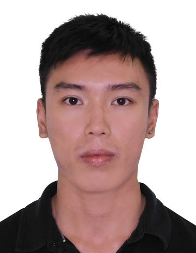
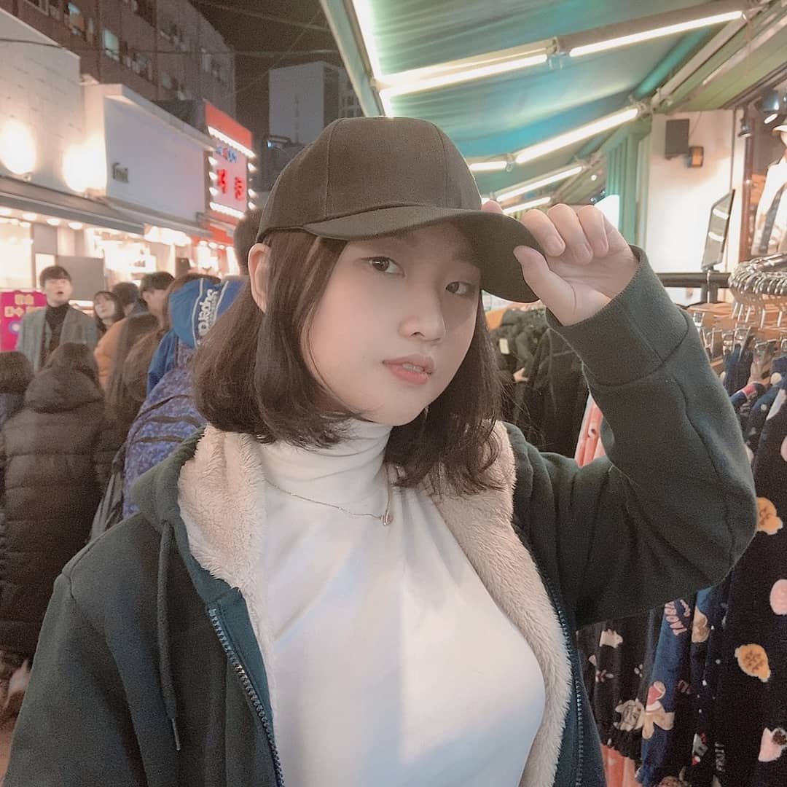
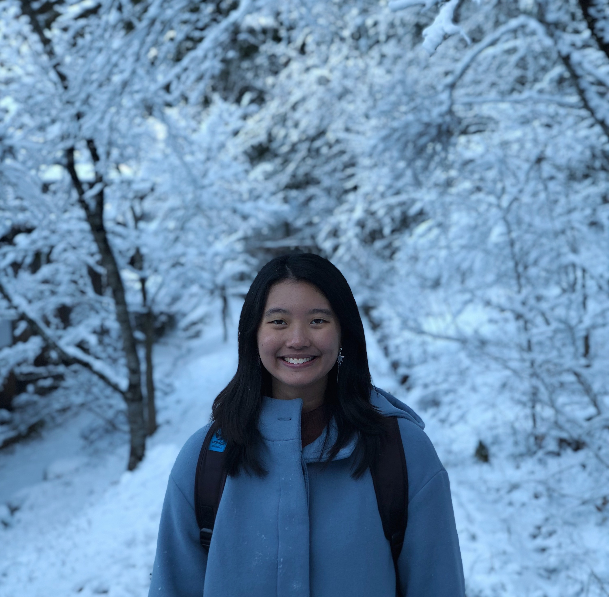
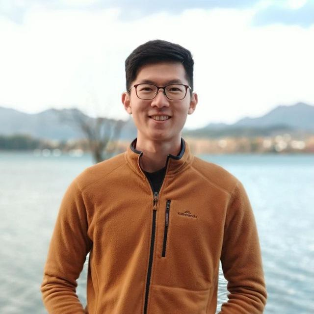
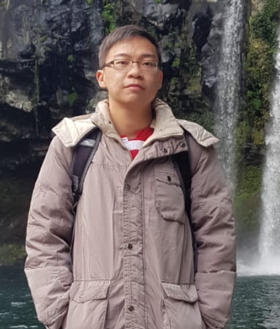

We are a team based in the [School of Computing, National University of Singapore](http://www.comp.nus.edu.sg).

You can reach us at the email `jarvis@comp.nus.edu.sg`

## Project team

### Associate Professor Damith Chatura Rajapakse

* Role: Lecturer, Tutor

### Wu Peirong

[[github](http://github.com/peironggg)]
[[portfolio](team/peironggg.md)]

* Role: Developer
* Responsibilities: API + Student Features

### Seo Yeryeon

[[github](http://github.com/wireseo)]
[[portfolio](team/wireseo.md)]

* Role: Developer
* Responsibilities: GUI + Consultation and Mastery Check Features

### Wiline Tan

[[github](http://github.com/wilinetan)]
[[portfolio](team/wilinetan.md)]

* Role: Developer
* Responsibilities: Mission and Quest Features + GUI

### Ng Zhen Teng

[[github](http://github.com/ngzhenteng)]
[[portfolio](team/ngzhenteng.md)]

* Role: Developer
* Responsibilities: Student Features + Testing

### Lim Jun Jie

[[github](http://github.com/asuraxsoul)]
[[portfolio](team/asuraxsoul.md)]

* Role: Developer
* Responsibilities: Tutor Task Features
