* Table of Contents
{:toc}

--------------------------------------------------------------------------------------------------------------------

## **Introduction**

### Purpose
The purpose of this document is to cover the multi-level design architecture of Jarvis, so that the intended audience
of this document can understand the relationship between components that make up Jarvis.

### Audience
This developer guide is for anyone who wants to understand the internal software architecture of Jarvis.
The following groups of people are the intended audience:
* Jarvis developers: anyone who wish to upgrade Jarvis to support more functions.
* CS1101S Avengers: tutors of CS1101S who wants to improve their efficiency and productivity.

### Jarvis Overview
Jarvis is a desktop app for CS1101S Teaching Assistants (Avengers), optimized for use via a Command Line Interface (CLI)
while still having the benefits of a Graphical User Interface (GUI). Jarvis in general helps to organise and simplify
CS1101S tutors' administrative tasks.

--------------------------------------------------------------------------------------------------------------------

## **Setting up, getting started**

Refer to the guide [_Setting up and getting started_](SettingUp.md).

--------------------------------------------------------------------------------------------------------------------

## **Design**

### Architecture

The ***Architecture Diagram*** given above explains the high-level design of Jarvis. Given below is a quick overview
 of each component.

:bulb: **Tip:** The `.puml` files used to create diagrams in this document can be found in the [diagrams](https://github.com/AY2021S1-CS2103T-W11-2/tp/tree/master/docs/diagrams/) folder. Refer to the [_PlantUML Tutorial_ at se-edu/guides](https://se-education.org/guides/tutorials/plantUml.html) to learn how to create and edit diagrams.

**`Main`** has two classes called [`Main`](https://github.com/AY2021S1-CS2103T-W11-2/tp/blob/master/src/main/java/seedu/jarvis/Main.java) and [`MainApp`](https://github.com/AY2021S1-CS2103T-W11-2/tp/blob/master/src/main/java/seedu/jarvis/MainApp.java). It is responsible for,
* At app launch: Initializes the components in the correct sequence, and connects them up with each other.
* At shut down: Shuts down the components and invokes cleanup methods where necessary.

[**`Commons`**](#common-classes) represents a collection of classes used by multiple other components.

The rest of Jarvis consists of five components.

* [**`UI`**](#ui-component): The UI of the App.
* [**`Logic`**](#logic-component): The command executor.
* [**`Model`**](#model-component): Holds the data of the App in memory.
* [**`Storage`**](#storage-component): Reads data from, and writes data to, the hard disk.
* [**`Scraper`**](#scraper-component): Scrapes [https://sourceacademy.nus.edu.sg](https://sourceacademy.nus.edu.sg) for course-info.

Each of the five components,

* defines its *API* in an `interface` with the same name as the Component.
* exposes its functionality using a concrete `{Component Name}Manager` class (which implements the corresponding API `interface` mentioned in the previous point.

For example, the `Logic` component (see the class diagram given below) defines its API in the `Logic.java` interface and exposes its functionality using the `LogicManager.java` class which implements the `Logic` interface.

**How the architecture components interact with each other**

The *Sequence Diagram* below shows how the components interact with each other for the scenario where the user issues
 the command `delete -c 1`.

The sections below give more details of each component.

### UI component

**API** :
[`Ui.java`](https://github.com/AY2021S1-CS2103T-W11-2/tp/blob/master/src/main/java/seedu/jarvis/ui/Ui.java)

The UI consists of a `MainWindow` that is made up of parts e.g.`CommandBox`, `ResultDisplay`, `XYZListPanel
`, `StatusBarFooter` etc. All these including the `MainWindow`, inherit from the abstract `UiPart` class.

`XYZListPanel` refers to the various types of `{Feature Type}ListPanel`
 objects. These are namely `StudentListPanel`, `MissionListPanel`, `QuestListPanel`, `ConsultationListPanel`, `MasteryCheckListPanel` and `TaskListPanel`.

The `UI` component uses JavaFx UI framework. The layout of these UI parts are defined in matching `.fxml` files that are in the `src/main/resources/view` folder. For example, the layout of the [`MainWindow`](https://github.com/AY2021S1-CS2103T-W11-2/tp/blob/master/src/main/java/seedu/jarvis/ui/MainWindow.java) is specified in [`MainWindow.fxml`](https://github.com/AY2021S1-CS2103T-W11-2/tp/blob/master/src/main/resources/view/MainWindow.fxml)

The `UI` component,

* Executes user commands using the `Logic` component.
* Listens for changes to `Model` data so that the UI can be updated with the modified data.

### Logic component

**API** :
[`Logic.java`](https://github.com/AY2021S1-CS2103T-W11-2/tp/blob/master/src/main/java/seedu/jarvis/logic/Logic.java)

1. `Logic` uses the `AddressBookParser` class to parse the user command.
1. This results in a `Command` object which is executed by the `LogicManager`.
1. The command execution can affect the `Model` (e.g. adding a student).
1. The result of the command execution is encapsulated as a `CommandResult` object which is passed back to the `Ui`.
1. In addition, the `CommandResult` object can also instruct the `Ui` to perform certain actions, such as displaying help to the user.

Given below is the Sequence Diagram for interactions within the `Logic` component for the `execute("delete -c 1")` API call.

:information_source: **Note:** The lifeline for `DeleteCommandParser` should end at the destroy marker (X) but due to a limitation of PlantUML, the lifeline reaches the end of diagram.

### Model component

**API** : [`Model.java`](https://github.com/AY2021S1-CS2103T-W11-2/tp/blob/master/src/main/java/seedu/jarvis/model/Model.java)

The `Model`,

* stores a `UserPref` object that represents the user’s preferences.
* stores a `UserLogin` object that represents the user's Source Academy login details.
* stores the DATA_CLASS - `Mission`, `Quest`, `Task`, `MasterCheck`, `Consultation` - in the addressbook.
* exposes unmodifiable `ObservableList<DATA_CLASS>` for each DATA_CLASS that can be 'observed' e.g. the UI can be bound to this list so that the UI automatically updates when the data in the list change.
* does not depend on any of the other three components.

### Storage component

**API** : [`Storage.java`](https://github.com/AY2021S1-CS2103T-W11-2/tp/blob/master/src/main/java/seedu/jarvis/storage/Storage.java)

The `Storage` component,
* can save `UserPref` objects in json format and read it back.
* can save `UserLogin` objects in json format and read it back.
* can save the address book data in json format and read it back.

### Scraper component

**API** : [`Scraper.java`](https://github.com/AY2021S1-CS2103T-W11-2/tp/blob/master/src/main/java/seedu/jarvis/scraper/Scraper.java)

The `Scraper` component,
* reads user login information from the `UserLogin` object passed to it.
* uses the _Chrome_Driver_ package to scrape [Source Academy](https://sourceacademy.nus.edu.sg) for course-info such as missions, quests, student names.
* can save the scraped information to `Model`.

### Common classes

Classes used by multiple components are in the `seedu.jarvis.commons` package.

--------------------------------------------------------------------------------------------------------------------

## **Implementation**

This section describes some noteworthy details on how certain key features have been implemented.

### Automatic Tab Switching
In this section we will explain how the `Automatic Tab Switching Feature` feature works. We will do so by going
 through a sequence diagram.

#### What is Automatic Tab Switching
`Automatic Tab Switching` is a feature where the displayed tab automatically changes to the relevant tab: `Student
` `Missions`, `Quests`, `Consultations`, `Mastery Checks` and `Tasks`, for the user's input command.

#### Interaction between objects when Automatic Tab Switching happens
The following is a sequence diagram explaining the interaction between `MainWindow`, `LogicManager` and
 `CommandResult` after the user keys in a command and presses the enter key in the Graphical User Interface.

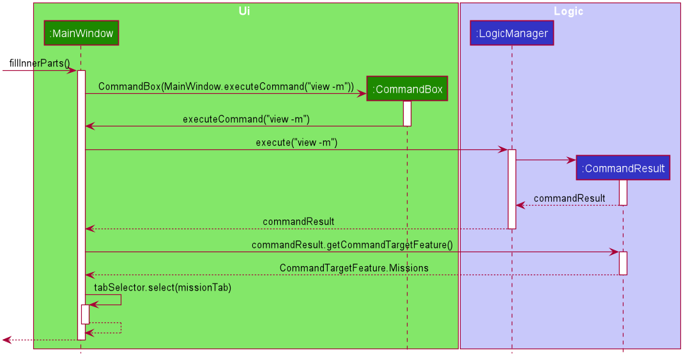

On start up of the GUI the `fillInnerParts` method of `MainWindow` is called, creating a `CommandBox` object with
a method reference to `MainWindow`'s `executeCommand` method passed as parameter to the constructor.

The `CommandBox` object will take the command keyed into the commandBox Ui component, in this case `"view -m"`, as parameters to
`MainWindow`'s `executeCommand` method, thereby invoking a call to the `LogicManager`'s `execute` method. `LogicManager` creates a `CommandResult` object and returns it to `MainWindow`.

`MainWindow` class calls the `CommandResult` object's `getCommandTargetFeature` method, which then returns a
 `CommandTargetFeature`, `Enum`
corresponding to the feature that the user input command relates to. Based on that `Enum`, `MainWindow` then selects the
 corresponding tab using its local variable `tabSelector`. In this case `Missions` was returned and hence the
  `missionTab` was selected.

As such, the corresponding tab is selected after a user command is inputted.

This feature works the same way for
viewing `Students`, `Quests`, `Consultations`, `MasteryChecks` and `Tasks`. In each case, the
corresponding `CommandTargetFeature` `Enum` is returned resulting in the corresponding tab selection.

### Summary Feature
In this section we will explain how the `Summary Feature` is implemented by going through a sequence diagram.

#### What is the Summary Feature
Summary feature refers to the summary string at the top right hand corner of the Jarvis Graphical User Interface. It
summarises the ungraded missions and quests, upcoming consultations and mastery checks as well as outstanding tasks.

It is always updated at any point in time of using Jarvis.

#### Interaction between objects to enable the Summary Feature
In order for the `Summary` string to be updated upon starting up the Jarvis Graphical User Interface and in sync with the
changes in data after each command, Jarvis calls the `ModelManager` `updateAllSummaryDetails` method
upon start up and after each command is executed. The following is a sequence diagram when a user command is
entered.

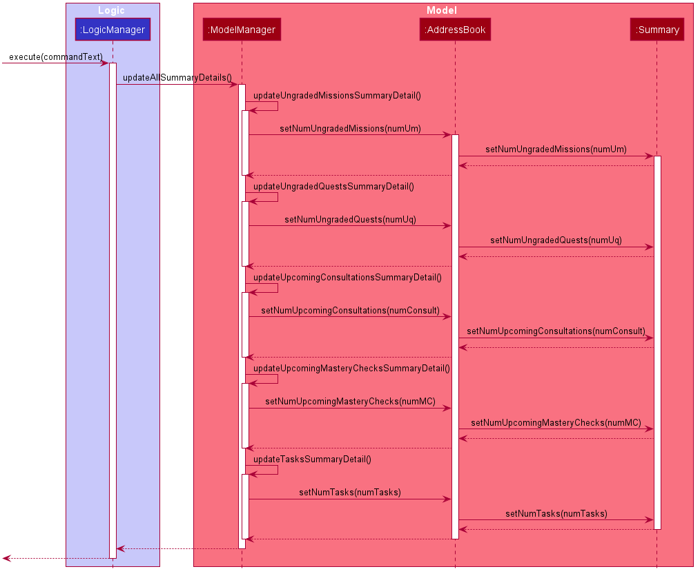

Upon keying in the user command, `LogicManager`'s `execute` method is called. This leads to the calling of
`ModelManager`'s `updateAllSummaryDetails` method, which thereby leads to a series of function calls to
`ModelManager`'s own methods `updateUngradedMissionsSummaryDetail`, `updateUngradedQuestsSummaryDetail` and so
 fourth.

Each of the methods obtains the
length of the corresponding `FilteredList` to find the exact value of the summary detail such as "number of ungraded
missions". The value is then set by calling the corresponding `AddressBook` setter methods, which then leads to the
corresponding call of the `Summary` object's setter method call.

The always updated `Summary` string is obtained through the `LogicManager` and displayed as a `Label` in the Graphical
User Interface.

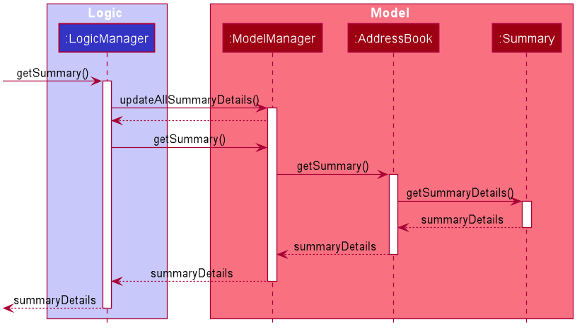

A `LogicManager` `getSummary` method call will lead to a sequence of method calls, which results in a `StringProperty` of summary details being returned.

Upon start up of Jarvis' Graphical User Interface, the first step of calling `LogicManager`'s `execute` method is
skipped, going straight to calling the `updateUngradedMissionsSummaryDetail` method of `ModelManager` to do the
similar syncing of summary details.

### Login
In this section, we will introduce how the login process works. We will do so through showing the expected path-execution
and interaction of objects between the `ScraperManager` and `Chrome Driver`.

:information_source: **Note:** Chrome Driver is a web scraper software provided by Google Chrome. It comes packaged with your download of Jarvis.

#### What is the login process
Login is a series of method calls that any new user who uses Jarvis has to go through. It is carried out by `ScraperManager` and involves fetching information from Source Academy through the use of a headless browser, _Chrome_Driver_.

#### Structure of login process
The following diagram shows the class relationship between the `ScraperManager` and other related classes. This will help in helping you understand the login process.

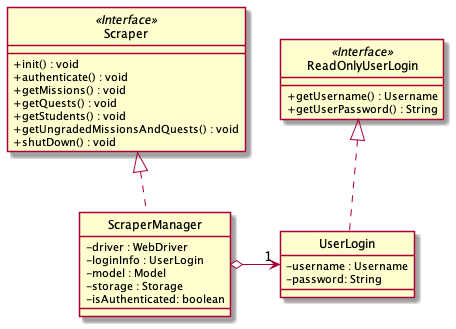

#### Path Diagram of login process
The following diagram shows the path diagram from the user's perspective when he or she logs in into Jarvis.
The login process is kickstarted whenever Jarvis is launched or the login details are edited.

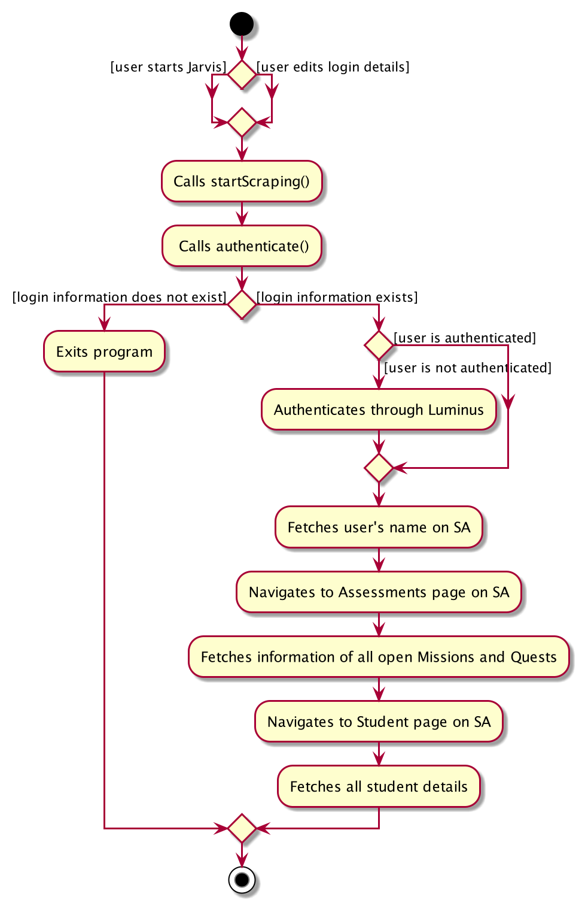

#### Sequence Diagram of login process

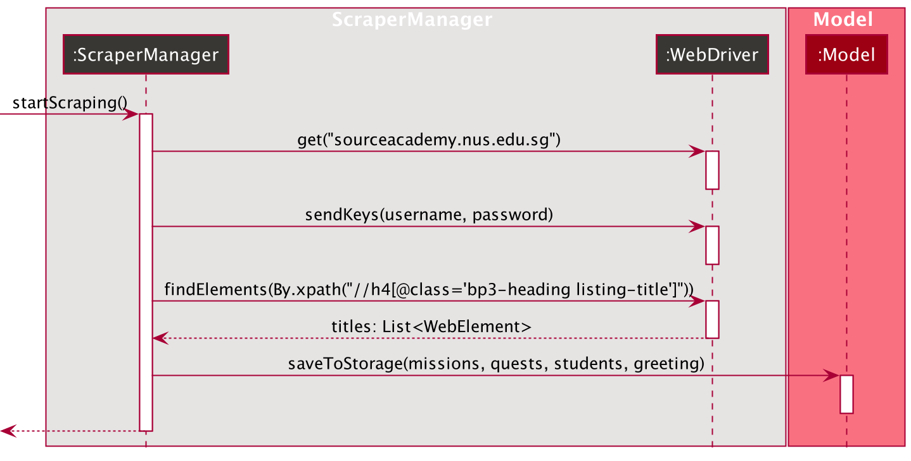

* The descriptor within the `XPath.by(...)` is the HTML descriptor for the HTML element that corresponds to each individual assessment title on Source Academy.
* The `Chrome Driver`, which is of type `WebDriver`, will look for all HTML elements on Source Academy that matches the HTML descriptor we passed in.
* `WebDriver` will return a `List<WebElement>`, with each element in the list corresponding to a single CS1101S mission. This list could be of size 0 if there are no active missions that day.
* `startScraping()` runs on a background thread, separate from the main thread. This ensures that the time-consuming task of fetching missions do not delay the updating of the GUI.
* In the event the login details are incorrect, Jarvis will resolve the problem by starting up with saved data (if it exists) or mock data (if it does not exist).

## View Command
In this section, we will introduce the `ViewCommand`. It will show the structure of the `ViewCommand` class and the `ViewCommandParser`
class, as well as the path diagram and sequence diagram of the `ViewMissionDeadlineCommand` to capture the interactions between
the `ViewMissionDeadlineCommand` and other object classes.

### What is ViewCommand
`ViewCommand` is an abstract class encapsulating the different view commands for the following: `Student`,
`Mission`, `Quest`, `Consultation`, `Mastery Check` and `Task`.

### Structure of ViewCommand

The following diagram shows the overview of the `ViewCommand` Class Diagram:

The abstract class `ViewCommand` extends from the abstract class `Command`. In the `ViewCommand` class, the abstract
method `execute` takes in a `Model` object. As such, all view commands that extend from the `ViewCommand` class will implement
the `execute` method. Thus, all view command classes have a dependency on `Model`.

In the `ViewCommand` class, there is a static message `MESSAGE_USAGE` for when user does not include a second argument since
view has to take in at least one argument. The message will guide the user on what parameters the `ViewCommand` can take in.

In all the view commands that extend from `ViewCommand`, there is a static message `MESSAGE_SUCCESS` for when the command
has executed successfully. The message will be shown to the user to indicate success.

### Structure of ViewCommandParser

The following diagram shows the overview of the `ViewCommandParser` Class Diagram:

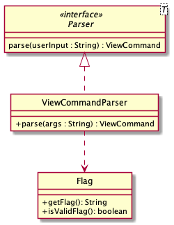

In the `ViewCommandParser` class, under the `parse()` method, we reference the `Flag` class which is a class that encapsulates
the different flags that `ViewCommand` can parse. We use the `Flag` class to check for whether an input is valid and go on to parse
the flag and return the correct `ViewCommand` object.

### Path Execution of ViewMissionDeadlineCommand
As there are many `ViewCommand` subclasses such as `ViewAllStudentsCommand` and `ViewConsultationsCommand`,
we will only bring in one of them. In this and the following section, we will be using the `ViewMissionDeadlineCommand`
as an example for the `ViewCommand` path execution and interaction between the different objects.
The diagram below demonstrates the expected path execution of `ViewMissionDeadlineCommand`.
The other `ViewCommand` subclasses will execute similarly.

### Interaction between objects when ViewMissionDeadlineCommand is executed
The sequence diagram for the `ViewMissionDeadlineCommand` is shown below:

The `LogicManager` will call the `parseCommand` method of `AddressBookParser`, which then passes the second argument to the `ViewCommandParser` object.
The `ViewCommandParser` will return a `ViewMissionDeadlineCommand` object. This object will then be returned to the `LogicManager`. Next, the `LogicManager` will call the `execute(model)` method using the
`ViewMissionDeadlineCommand` object. In this method, it will use the `Model` object to call the method : `updateMissionList()`, with parameter `PREDICATE_SHOW_ALL_MISSIONS` which will show all the missions. When completed, the `execute(model)` will return a
`CommandResult` object with the success message to the `LogicManager`, indicating that the command execution is a success.

The other `ViewCommand` subclasses work similarly to this as well.

## Add Command
In this section, we will introduce the Add Command. It will show the structure of the `AddCommand` class and the `AddCommandParser`
class, as well as the path diagram and sequence diagram of the `AddTaskCommand` to capture the interactions between
the `AddTaskCommand` and other object classes.

:information_source: **Note:** The AddCommand overall structure is similar to that of the ViewCommand above.

### What is AddCommand
`ViewCommand` is an abstract class encapsulating the different add commands for the following: `Consultation`,
`Mastery Check` and `Task`.

### Structure of AddCommand
The following diagram shows the overview of the AddComand Class Diagram:

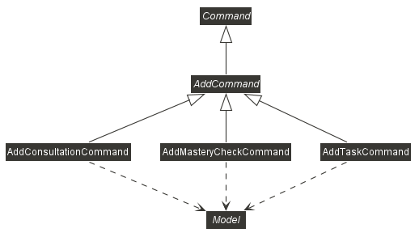

* Upon parsing user input to the correct `AddCommand` (ie. `AddXYZCommand`) which is done by the `AddCommandParser`, the
correct `Model` object (eg. `Student`, `Task`) will be added to the corresponding list in `Model` class.
* Then, updated lists of data will be observed by the `AddressBook`, and displayed on the GUI.

The abstract class `AddCommand` extends from the abstract class `Command`. In the `AddCommand` class, the abstract
method `execute` takes in a `Model` object. As such, all view commands that extend from the `AddCommand` class will implement
the `execute` method. Thus, all add command classes have a dependency on `Model`.

In the `AddCommand` class, there is a static message `MESSAGE_USAGE` for when user does not include a second argument since
view has to take in at least one argument. The message will guide the user on what parameters the `AddCommand` can take in.

In all the add commands that extend from `AddCommand`, while there is a static message `MESSAGE_SUCCESS` for when the
command has executed successfully, there is also a static message `MESSAGE_INVALID` that comes in different variants for
when the command has not executed successfully due to an expected error from the user.

### Structure of AddXYZCommand
The following diagram shows the overview of `AddCommand` detailed Class Diagram which has a similar structure as other `Commands`:

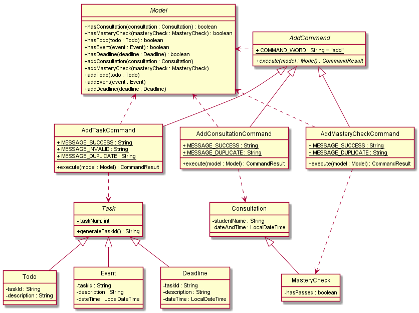

* The class `AddCommand` contains 3 subclasses: `AddTaskCommand`, `AddConsultationCommand` and `AddMasteryCheckCommand`.
* These `AddCommand` subclasses interacts with `Model` and the related class models each AddCommand is supposed to execute with.
* Upon successful `AddCommand`, these subclasses communicates with `Model` to add `Task`, `Consultation` and `MasteryCheck` into `Model`.

### Structure of AddCommandParser
The following diagram shows the overview of the AddCommandParser Class Diagram:

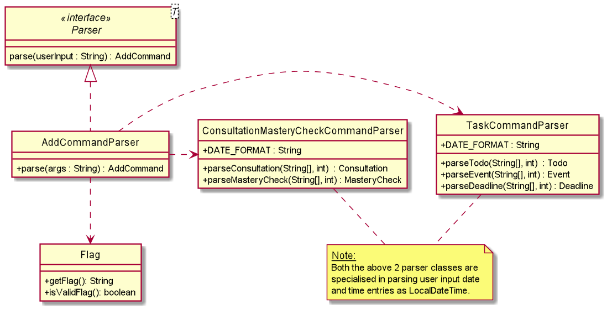

In the `AddCommandParser` class, under the `parse()` method, we reference the `Flag` class which is a class that encapsulates
the different flags that `AddCommand` can parse. We use the `Flag` class to check for whether an input is valid and go on to parse
the flag and return the correct `AddCommand` object.

Due to Java `LocalDateTime` class used for our `Consultation`, `MasteryCheck` `Event` and `Deadline` objects, `ConsultationMasteryCheckCommandParser`
and `TaskCommandParser` are employed to parse the objects added.

### Path Execution of AddTaskCommand
As there are many `AddCommand` subclasses such as `AddTaskCommand` and `AddConsultationCommand`,
we will only bring in one of them. In this and the following section, we will be using the `AddTaskCommand`
as an example for the `AddCommand` path execution and interaction between the different objects.
The diagram below demonstrates the expected path execution of `AddTaskCommand`.
The other `AddCommand` subclasses will execute similarly.

:information_source: **Reminder:** There are 3 `Task` types, namely, `Todo`, `Event` and `Deadline`.

### Interaction between objects when AddTaskCommand is executed
The sequence diagram for the `AddTaskCommand` adding an `Event` is shown below:

The `LogicManager` will call the `parseCommand` method of `AddressBookParser`, which then passes the second argument to the newly created `AddCommandParser` object.
The `AddCommandParser` will then call specific parse method, in this case, `parseEvent` method of `TaskCommandParser`. `TaskCommandParser` returns an `Event` object
created to `AddCommandParser` so that it can return a new `AddTaskCommand` is created with the `Event` object.
This object will then be returned to the `LogicManager`. Next, the `LogicManager` will call the `execute(model)` method using the
`AddTaskCommand` object. In this method, it will use the `Model` object to call the method : `hasEvent()`, which checks if there is a duplicated `Event` in the `Model`.
Once successful, the `execute(model)` will return a `CommandResult` object with the success message to the `LogicManager`, indicating that the command execution is a success.

The other `ViewCommand` subclasses work similarly to this as well.

## Delete Command
In this section, we will introduce the `Delete Command`. It will show the structure of the `DeleteCommand` class and the `DeleteCommandParser`
class, as well as the path diagram and sequence diagram of the `DeleteConsultationCommand` to capture the interactions between
the `DeleteConsultationCommand` and other object classes.

### What is DeleteCommand
`DeleteCommand` is an abstract class encapsulating the different delete commands for the `Consultations`,
`Mastery Checks`, and `Tasks`.

### Structure of DeleteCommand

The following diagram shows the overview of the `DeleteCommand` Class Diagram:

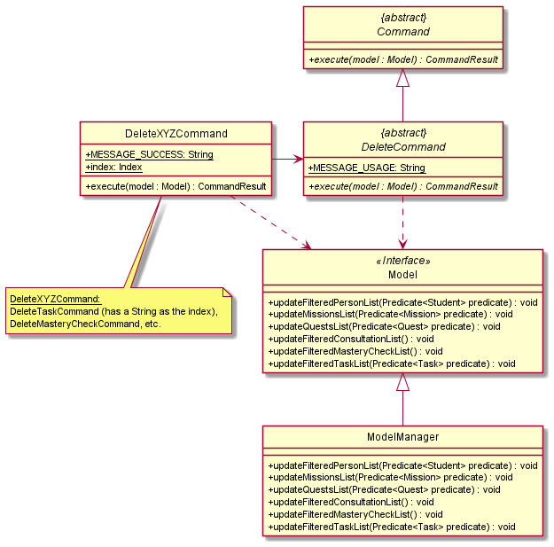

The abstract class `DeleteCommand` extends from the abstract class `Command`. In the `DeleteCommand` class, the abstract
method `execute` takes in a `Model` object. As such, all delete commands that extend from the `DeleteCommand` class will implement
the `execute` method. Thus, all delete command classes have a dependency on `Model`.

In the `DeleteCommand` class, there is a static message `MESSAGE_USAGE` for when user does not include a second argument since
delete has to take in at least one argument. The message will guide the user on what parameters the `DeleteCommand` can take in.

In all the delete commands that extend from `DeleteCommand`, there is a static message `MESSAGE_SUCCESS` for when the command
has executed successfully. The message will be shown to the user to indicate success.

### Structure of DeleteCommandParser

The following diagram shows the overview of the DeleteCommandParser Class Diagram:

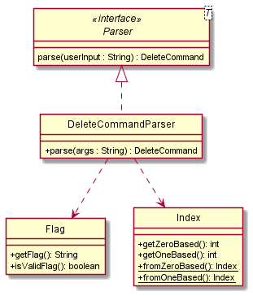

In the `DeleteCommandParser` class, under the `parse()` method, we reference the `Flag` class which is a class that encapsulates
the different flags that `DeleteCommand` can parse. We use the `Flag` class to check for whether an input is valid and go on to parse
the flag and return the correct `DeleteCommand` object.

Additionally, under the same method, we reference the `Index` class which encapsulates
the numerical indexes that `DeleteCommand` can parse. We use the `Index` class to check for whether the input is a non-zero unsigned integer
and go on to parse the index and provide the parameter necessary to instantiate the aforementioned `DeleteCommand` object.

The `Index` only applies for `DeleteConsultationCommand` and `DeleteMasteryCheckCommand` as `DeleteTaskCommand` utilizes a `String` to store identifiers instead;
however, they are similar in how they operate and interact with the rest of the system.

### Path Execution of DeleteConsultationCommand
As there are many `DeleteCommand` subclasses such as `DeleteMasteryCheckCommand` and `DeleteTaskCommand`,
we will only bring in one of them. In this and the following section, we will be using the `DeleteConsultationCommand`
as an example for the `DeleteCommand` path execution and interaction between the different objects.
The diagram below demonstrates the expected path execution of `DeleteConsultationCommand`.
The other `DeleteCommand` subclasses will execute similarly.

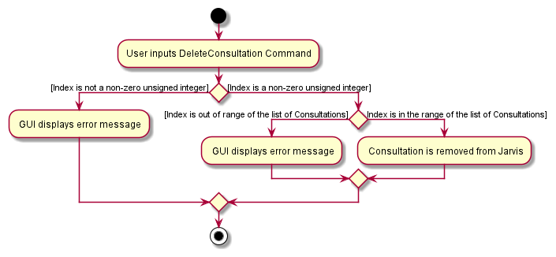

### Interaction between objects when DeleteConsultationCommand is executed
The sequence diagram for the `DeleteConsultationCommand` is shown below:

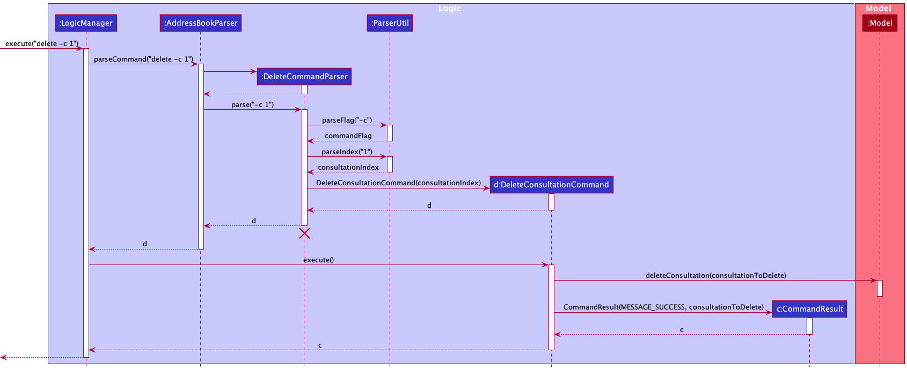

The `LogicManager` will call the `parseCommand` method of `AddressBookParser`, which then passes the arguments to the `DeleteCommandParser` object.
The `DeleteCommandParser`, after parsing the necessary arguments through static methods of the `ParserUtil` class, will return a `DeleteConsultationCommand` object.
This object will then be returned to the `LogicManager`. Next, the `LogicManager` will call the `execute(model)` method using the `DeleteConsultationCommand` object.
In this method, it will use the `Model` object to call the method `deleteConsultation()` with parameter `consultationToDelete` which will delete the specified
consultation from the list of consultations stored in Jarvis. When completed, the `execute(model)` will return a `CommandResult` object with the success message
to the `LogicManager`, indicating that the command execution is a success.

The other `DeleteCommand` subclasses work similarly to this as well.

## Edit Command
In this section, we will introduce the `Edit Command`. It will show the structure of the `EditCommand` class as well as the path diagram and sequence diagram of the
`EditLoginCommand` to capture the interactions between the `EditLoginCommand` and other object classes.

### What is Edit Command
The `EditCommand` is an abstract class encapsulating the different implementations to edit `Student`, `UserLogin` and `MasterCheck`.

### Structure of Edit Command
The following diagram shows the overview of the EditCommand Class Diagram:

* Upon parsing user input to the correct `EditCommand` (ie. `EditXYZCommand`) which is done by the `EditCommandParser`, the
correct `Model` object (eg. `Student`, `UserLogin`) will be added to the corresponding list in `Model` class.
* Then, updated lists of data will be written to the `AddressBook`, and displayed on the GUI.

### Path Diagram of EditLoginCommand

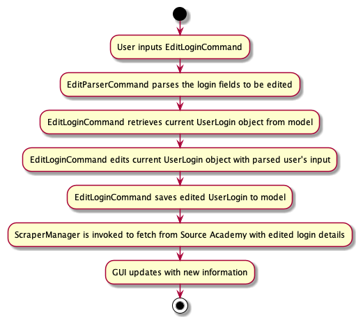

There are 3 `EditCommand` subclasses - `EditStudentCommand`, `EditLoginCommand` and `EditMasteryCheckCommand`.
We will only use the `EditLoginCommand` as an example for the `EditCommand` path execution and interaction between the different objects.
The diagram below demonstrates the expected path execution of `EditLoginCommand`.
The other `EditCommand` subclasses will execute similarly, less the calls to `ScraperManager` to re-scrape Source Academy.

### Sequence Diagram of EditLoginCommand

The sequence of method calls are highly similar to that for the `EditLoginCommand` above. What is of note is the additional call to `Scraper`.
This is executed to allow Jarvis to refresh the GUI with updated information relevant to the new user that has logged in.

--------------------------------------------------------------------------------------------------------------------

## **Documentation, logging, testing, configuration, dev-ops**

* [Documentation guide](Documentation.md)
* [Testing guide](Testing.md)
* [Logging guide](Logging.md)
* [Configuration guide](Configuration.md)
* [DevOps guide](DevOps.md)

--------------------------------------------------------------------------------------------------------------------

## **Appendix: Requirements**

### Product scope

**Target user profile**:

* CS1101S tutor who has to keep track of student submissions and consultations
* can type fast
* prefers typing to mouse interactions
* is reasonably comfortable using CLI apps

**Value proposition**: the only tool to keep tutor todos and responsibilities in check

### User stories

Priorities: High (must have) - `* * *`, Medium (nice to have) - `* *`, Low (unlikely to have) - `*`

| Priority | As a …​                                      | I want to …​                            | So that I …​                                                 |
| -------- | ------------------------------------------- | ------------------------------         | ----------------------------------------------------------- |
| `* * *`  | tutor                                       | see usage instructions                 | can refer to instructions when I forget how to use the App. |
| `* * *`  | tutor                                       | edit a student                         | can keep the contact details of all my students updated.    |
| `* * *`  | tutor                                       | automatically view my students         | can know who to contact.                                    |
| `* * *`  | tutor                                       | list all unmarked assignments          | will not miss out on marking any overdue missions or quests.|
| `* * *`  | tutor                                       | view deadlines of missions/quests      | know when I can start marking them.                         |
| `* * *`  | tutor                                       | add consultations                      | keep track of my consultation schedule easily.              |
| `* * *`  | tutor                                       | list consultations                     | be reminded of my consultation schedule.                    |
| `* *`    | tutor                                       | list only past consultations           | look through my past consultation schedule.                 |
| `* *`    | tutor                                       | list only upcoming consultations       | be reminded of upcoming consultations easily.               |
| `* * *`  | tutor                                       | delete a consultation                  | can reflect cancellations or rescheduling.                  |
| `* * *`  | tutor                                       | add mastery checks                     | keep track of my mastery check schedule easily.             |
| `* * *`  | tutor                                       | list mastery checks                    | be reminded of my mastery check schedule.                   |
| `* *`    | tutor                                       | list only past mastery checks          | look through my past mastery check schedule.                |
| `* *`    | tutor                                       | list only upcoming mastery checks      | be reminded of upcoming mastery checks easily.              |
| `* * *`  | tutor                                       | delete a mastery check                 | can reflect cancellations or rescheduling.                  |
| `* * *`  | tutor                                       | add my own tasks                       | can be consolidate all TA and non-TA scheduling into Jarvis.|
| `* * *`  | tutor                                       | list my own tasks                      | can have an overview of all my tasks.                       |
| `* * *`  | tutor                                       | delete tasks                           | can keep track of complete/unnecessary and incomplete tasks.|

### Use cases

(For all use cases below, the **System** is `Jarvis` and the **Actor** is the `CS1101S tutor`, unless specified otherwise)

**Use case: UC1 - View Consultations**

**MSS**

1.  User requests to view Consultations.
2.  Jarvis shows a list of all Consultations.

    Use case ends.

**Extensions**

* 1a. The user enters an invalid command.

    * 1a1. Jarvis shows an error message.

      Use case ends.

* 1b. The list is empty.

    Use case ends.

 **Use case: UC2 - View Mastery Checks**

**MSS**

1.  User requests to view Mastery Checks.
2.  Jarvis shows a list of all Mastery Checks.

    Use case ends.

**Extensions**

* 1a. The user enters an invalid command.

    * 1a1. Jarvis shows an error message.

      Use case ends.

* 1b. The list is empty.

    Use case ends.

 **Use case: UC3 - Delete a Consultation**

**MSS**

1. User requests to delete a Consultation with the respective index in currently displayed list.
2. Jarvis deletes the Consultation.

    Use case ends.

**Extensions**

* 1a. The user enters an invalid command.

    * 1a1. Jarvis shows an error message.

      Use case ends.

* 1b. The given index is invalid (not a non-zero unsigned integer).

    * 1b1. Jarvis shows an error message.

        Use case ends.

* 1c. The given index is out of the range of the list.

    * 1c1. Jarvis shows an error message.

        Use case ends.

* 1d. The list is empty.

    Use case ends.

 **Use case: UC4 - Delete a Mastery Check**

**MSS**

1. User requests to delete a Mastery Check with the respective index in currently displayed list.
2. Jarvis deletes the Mastery Check.

    Use case ends.

**Extensions**

* 1a. The user enters an invalid command.

    * 1a1. Jarvis shows an error message.

      Use case ends.

* 1b. The given index is invalid (not a non-zero unsigned integer).

    * 1b1. Jarvis shows an error message.

      Use case ends.

* 1c. The given index is out of the range of the list.

    * 1c1. Jarvis shows an error message.

      Use case ends.

* 1d. The list is empty.

    Use case ends.

 **Use case: UC5 - Add a Consultation**

**MSS**

1. User requests to add a Consultation.
2. Jarvis adds a Consultation for the given student name at the specified date and time.

    Use case ends.

**Extensions**

* 1a. The user enters an invalid command.

    * 1a1. Jarvis shows an error message.

      Use case ends.

* 1b. The user enters an invalid date or time.

    * 1b1. Jarvis shows an error message.

      Use case ends.

* 1c. The user does not enter all parameters (student name or date and time).

    * 1c1. Jarvis shows an error message.

      Use case ends.

 **Use case: UC6 - Add a Mastery Check**

**MSS**

1. User requests to add a Mastery Check.
2. Jarvis adds a Mastery Check for the given student name at the specified date and time.

    Use case ends.

**Extensions**

* 1a. The user enters an invalid command.

    * 1a1. Jarvis shows an error message.

      Use case ends.

* 1b. The user enters an invalid date or time.

    * 1b1. Jarvis shows an error message.

      Use case ends.

* 1c. The user does not enter all parameters (student name or date and time).

    * 1c1. Jarvis shows an error message.

      Use case ends.

 **Use case: UC7 - Edit a Mastery Check**

**MSS**

1. User requests to edit a Mastery Check.
2. Jarvis edits the score of the Mastery Check at the given index as the given score value.

    Use case ends.

**Extensions**

* 1a. The user enters an invalid command.

    * 1a1. Jarvis shows an error message.

      Use case ends.

* 1b. The given index is invalid (not a non-zero unsigned integer).

    * 1b1. Jarvis shows an error message.

      Use case ends.

* 1c. The given index is out of the range of the list.

    * 1c1. Jarvis shows an error message.

      Use case ends.

* 1d. The given score value is not 0 or 1.

    * 1d1. Jarvis shows an error message.

      Use case ends.

* 1e. The list is empty.

    Use case ends.

 **Use case: UC8 - Add a Todo**

**MSS**

1. User requests to add a personal todo task.
2. Jarvis adds a personal todo task with description.

    Use case ends.

**Extensions**

* 1a. The user enters an invalid command.

    * 1a1. Jarvis shows an error message.

      Use case ends.

* 1b. The user does not enter a description.

    * 1b1. Jarvis shows an error message.

      Use case ends.

 **Use case: UC9 - Add an Event**

**MSS**

1. User requests to add a personal event task at the specified time and date.
2. Jarvis adds a personal event task at the specified time and date.

    Use case ends.

**Extensions**

* 1a. The user enters an invalid command.

    * 1a1. Jarvis shows an error message.

      Use case ends.

* 1b. The user does not enter a description.

    * 1b1. Jarvis shows an error message.

      Use case ends.

* 1c. The user enters an invalid date or time.

    * 1c1. Jarvis shows an error message.

      Use case ends.

 **Use case: UC10 - Add a Deadline**

**MSS**

1. User requests to add a personal deadline task at the specified time and date.
2. Jarvis adds a personal deadline task at the specified time and date.

    Use case ends.

**Extensions**

* 1a. The user enters an invalid command.

    * 1a1. Jarvis shows an error message.

      Use case ends.

* 1b. The user does not enter a description.

    * 1b1. Jarvis shows an error message.

      Use case ends.

* 1c. The user enters an invalid date or time.

    * 1c1. Jarvis shows an error message.

      Use case ends.

 **Use case: UC11 - Delete a Task**

**MSS**

1. User requests to delete a personal task in the current list of tasks with its id number.
2. Jarvis deletes the task.

    Use case ends.

**Extensions**

* 1a. The user enters an invalid command.

    * 1a1. Jarvis shows an error message.

      Use case ends.

* 1b. The list is empty.

    Use case ends.

* 1c. The given index is invalid.

    * 1c1. Jarvis shows an error message.

    Use case ends.

 **Use case: UC12 - View Tasks**

**MSS**

1.  User requests to view their personal tasks.
2.  Jarvis shows a list of tasks.

    Use case ends.

**Extensions**

* 1a. The user enters an invalid command.

    * 1a1. Jarvis shows an error message.

      Use case ends.

 **Use case: UC13 - Closes the Jarvis program**

**MSS**

1. The user finishes using Jarvis program.
2. The user proceeds to close the program.

    Use case ends.

### Non-Functional Requirements

1.  Should work on _mainstream Operating System_ as long as it has Java `11` or above installed.
2.  Should be able to hold up to 1000 students without a noticeable sluggishness in performance for typical usage.
3.  A user with above average typing speed for regular English text (i.e. not code, not system admin commands) should be able to accomplish most of the tasks faster using commands than using the mouse.
4. The system should be backward compatible with data produced by earlier versions of the system.
5. The system should work on both 32-bit and 64-bit environments.
6. The system should respond within one second.
7. For now, the product is not required to handle the printing of reports.
8. The application should not use copyrighted images anywhere in the UI.
9.  Should be easy for the user to migrate all information in Jarvis onto a separate computer.

### Glossary

* **Mainstream Desktop Operating System**: Windows, Linux, Unix, OS-X
* **Private contact detail**: A contact detail that is not meant to be shared with others
* **Mastery Check**: Type of special `Consultation` that is recorded and graded in the CS1101S module. It extends from `Consultation` class.
* **Task**: An abstract class that encompasses 3 subclasses, `Todo`, `Event` and `Deadline`. `Todo` is a basic simple `Task` that is usually not constrained by time; `Event` is
a `Task` that requires completion at a particular point in time; `Deadline` is a `Task` that requires completion before a particular point in time.

--------------------------------------------------------------------------------------------------------------------

## **Appendix: Instructions for manual testing**

Given below are instructions to test the app manually.

:information_source: **Note:** These instructions only provide a starting point for testers to work on;
testers are expected to do more *exploratory* testing.

### Launch and shutdown

1. Initial launch

   1. Download the jar file and copy into an empty folder

   1. Double-click the jar file Expected: Shows the GUI with a set of sample contacts. The window size may not be optimum.

1. Saving window preferences

   1. Resize the window to an optimum size. Move the window to a different location. Close the window.

   1. Re-launch the app by double-clicking the jar file. 
      Expected: The most recent window size and location is retained.

1. Saving login details

   1. Successfully Edit the correct `username` and `password` upon launching the program.
      Expected: `login.json` file saves most recent correct `username` and `password`.

1. Shutdown

   1. Click the cross button at top right side of window for WindowsOS, and top left side of window for MacOS.

   1. Type `exit` command in the Command Box in GUI.
      Expected: Stops and closes the program.

### Deleting a Consultation

1. Deleting a `Consultation` while all `Consultation`s are being shown

   1. Prerequisites: List all `Consultation`s using the `view -c` command. Multiple `Consultation`s in the list.

   1. Test case: `delete -c 1` 
      Expected: First `Consultation` is deleted from the list. Details of the deleted `Consultation` shown in the status message. GUI `Consultation` list is immediately updated.

   1. Test case: `delete -c 0` 
      Expected: No `Consultation` is deleted. Error details shown in the status message. GUI `Consultation` list under `Consultation` tab remains the same.

   1. Other incorrect delete commands to try: `delete`, `delete -c x`, `...` (where x is larger than the list size or smaller than 1) 
      Expected: Similar to previous.

### Adding a Deadline

1. Adding a `Deadline`

   1. Test case: `add -d example deadline d/2020-12-12 t/17:55` 
      Expected: A new `Deadline` is added to the end of the list. Details of the newly added `Deadline` shown in the status message. GUI `Task` list under the `Task` tab is immediately updated.

   1. Test case: `add -d d/2020-12-12 t/17:55` 
      Expected: No `Deadline` is added due to missing description. Error details shown in the status message. GUI `Task` list remains the same.

   1. Other incorrect add commands to try: `add -d example deadline d/ t/17:55`, `add -d example deadline d/2020-02-31 t/20:20`, `...` 
      Expected: Similar to previous due to incorrect date and time or missing input.

### Viewing a Student

1. View a `Student` while all `Student`s are being shown

   1. Prerequisites: At least have 1 `Student` under the `Student` tab in GUI.

   1. Test case: `view -s peter pan` 
      Expected: Success message of viewing 1 `Student` is shown in the status message. `Student` with name `peter pan` is filtered and shown in the `Student` list on the GUI.

   1. Test case: `view -s invalid name` 
      Expected: No `Student` of such name is found. GUI displays empty `Student` list, showing "No Student" text.

   1. Test case: `view -s` 
      Expected: Success message of viewing all `Student`s is shown in the status message. All `Student`s displayed in the GUI under the `Student` tab.

### Edit Login Details

1. Edit `Username` and / or `Password`

   1. Prerequisites: A tutor of CS1101S, to be able to log into Source Academy.

   1. Test case: `edit -l u/username p/password`, `edit -l u/username` or `edit -l p/password` 
      Expected: Success message of editing username and password is shown in the status message. `username` and `password` saved to `login.json` file. Welcome message reflected on GUI.

   1. Test case: `edit -l`, `edit -l t/password`, `...` 
      Expected: Error message shown in the status message. GUI welcome message remains unchanged. `login.json` file remains unchanged.

### Saving data

1. Dealing with missing/corrupted data files

   1. Data file, `jarvis.json` is edited incorrectly manually while the program is running.
      Expected: No harm is caused. Once program shuts down or a new command is inputted in GUI, `jarvis.json` is rewritten as per what is correct previously.

   1. No Internet Connection while using the program.
      Expected: No harm is caused. Changes are made and saved locally after the program is launched and the GUI is up. New modifications through using the program is still saved in `jarvis.json`.

1. Autosave per command and on shutdown

   1. Successful command inputted in GUI
      Expected: `jarvis.json` is saved automatically after every successful command. Does not matter if the command affects `jarvis.json` file data or not.

   1. Unsuccessful command inputted in GUI
      Expected: `jarvis,json` does not update or save automatically. The incorrect command is ignored.
