* Table of Contents
{:toc}

--------------------------------------------------------------------------------------------------------------------

## **Introduction**

###Purpose
The purpose of this document is to cover the multi-level design architecture of JARVIS, so that the intended audience
of this document can understand the relationship between components that make up JARVIS.

###Audience
This developer guide is for anyone who wants to understand the internal software architecture of JARVIS.
The following groups of people are the intended audience:
* JARVIS developers: anyone who wish to upgrade JARVIS to support more functions.
* CS1101S Avengers: tutors of CS1101S who wants to improve their efficiency and productivity.

###JARVIS Overview
JARVIS is a desktop app for CS1101S Teaching Assistants (Avengers), optimized for use via a Command Line Interface (CLI)
while still having the benefits of a Graphical User Interface (GUI). JARVIS in general helps to organise and simplify
CS1101S tutors' administrative tasks.

--------------------------------------------------------------------------------------------------------------------

## **Setting up, getting started**

Refer to the guide [_Setting up and getting started_](SettingUp.md).

--------------------------------------------------------------------------------------------------------------------

## **Design**

### Architecture

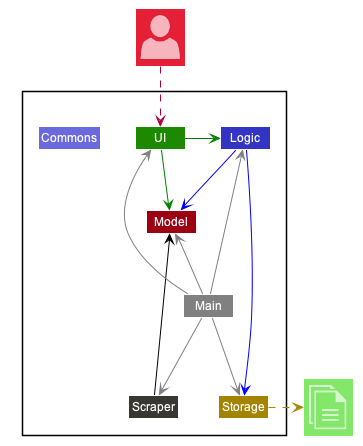

The ***Architecture Diagram*** given above explains the high-level design of the App. Given below is a quick overview of each component.

:bulb: **Tip:** The `.puml` files used to create diagrams in this document can be found in the [diagrams](https://github.com/se-edu/addressbook-level3/tree/master/docs/diagrams/) folder. Refer to the [_PlantUML Tutorial_ at se-edu/guides](https://se-education.org/guides/tutorials/plantUml.html) to learn how to create and edit diagrams.

**`Main`** has two classes called [`Main`](https://github.com/se-edu/addressbook-level3/tree/master/src/main/java/seedu/address/Main.java) and [`MainApp`](https://github.com/se-edu/addressbook-level3/tree/master/src/main/java/seedu/address/MainApp.java). It is responsible for,
* At app launch: Initializes the components in the correct sequence, and connects them up with each other.
* At shut down: Shuts down the components and invokes cleanup methods where necessary.

[**`Commons`**](#common-classes) represents a collection of classes used by multiple other components.

The rest of the App consists of five components.

* [**`UI`**](#ui-component): The UI of the App.
* [**`Logic`**](#logic-component): The command executor.
* [**`Model`**](#model-component): Holds the data of the App in memory.
* [**`Storage`**](#storage-component): Reads data from, and writes data to, the hard disk.
* [**`Scraper`**](#scraper-component): Scrapes Sourceacademy.com for course-info.

Each of the five components,

* defines its *API* in an `interface` with the same name as the Component.
* exposes its functionality using a concrete `{Component Name}Manager` class (which implements the corresponding API `interface` mentioned in the previous point.

For example, the `Logic` component (see the class diagram given below) defines its API in the `Logic.java` interface and exposes its functionality using the `LogicManager.java` class which implements the `Logic` interface.

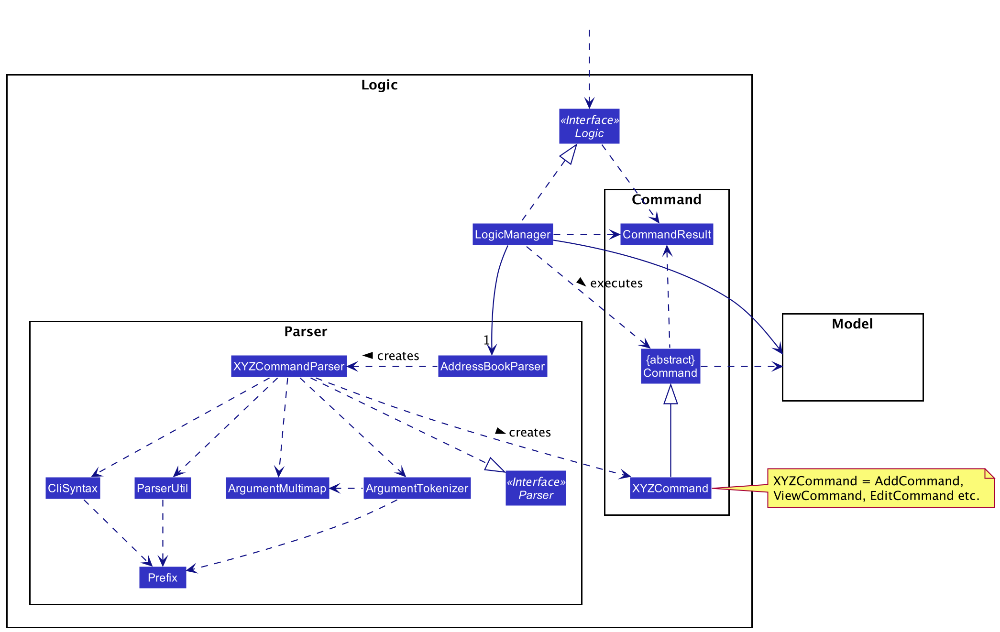

**How the architecture components interact with each other**

The *Sequence Diagram* below shows how the components interact with each other for the scenario where the user issues the command `delete 1`.

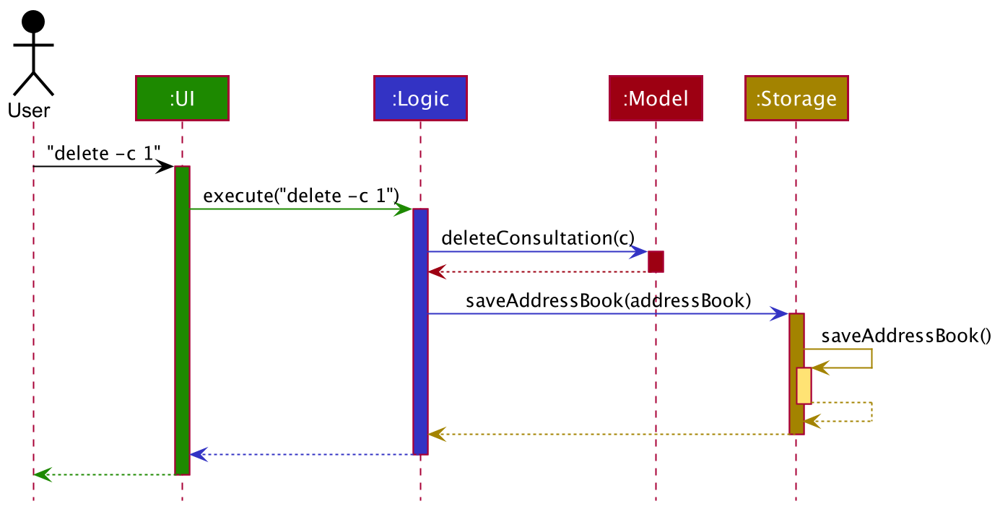

The sections below give more details of each component.

### UI component

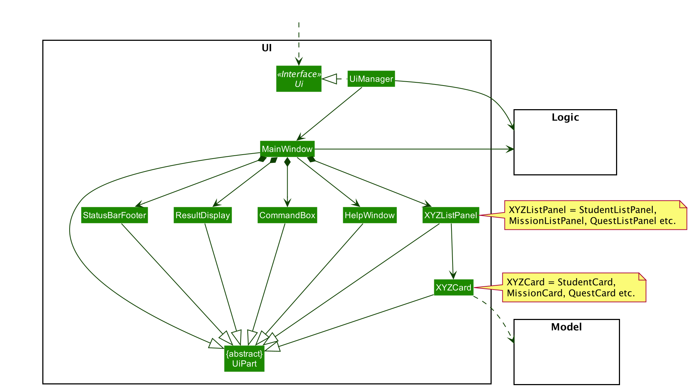

**API** :
[`Ui.java`](https://github.com/AY2021S1-CS2103T-W11-2/tp/blob/master/src/main/java/seedu/address/ui/Ui.java)

The UI consists of a `MainWindow` that is made up of parts e.g.`CommandBox`, `ResultDisplay`, `PersonListPanel`, `StatusBarFooter` etc. All these, including the `MainWindow`, inherit from the abstract `UiPart` class.

The `UI` component uses JavaFx UI framework. The layout of these UI parts are defined in matching `.fxml` files that are in the `src/main/resources/view` folder. For example, the layout of the [`MainWindow`](https://github.com/se-edu/addressbook-level3/tree/master/src/main/java/seedu/address/ui/MainWindow.java) is specified in [`MainWindow.fxml`](https://github.com/se-edu/addressbook-level3/tree/master/src/main/resources/view/MainWindow.fxml)

The `UI` component,

* Executes user commands using the `Logic` component.
* Listens for changes to `Model` data so that the UI can be updated with the modified data.

### Logic component

**API** :
[`Logic.java`](https://github.com/AY2021S1-CS2103T-W11-2/tp/blob/master/src/main/java/seedu/address/logic/Logic.java)

1. `Logic` uses the `AddressBookParser` class to parse the user command.
1. This results in a `Command` object which is executed by the `LogicManager`.
1. The command execution can affect the `Model` (e.g. adding a student).
1. The result of the command execution is encapsulated as a `CommandResult` object which is passed back to the `Ui`.
1. In addition, the `CommandResult` object can also instruct the `Ui` to perform certain actions, such as displaying help to the user.

Given below is the Sequence Diagram for interactions within the `Logic` component for the `execute("delete 1")` API call.

:information_source: **Note:** The lifeline for `DeleteCommandParser` should end at the destroy marker (X) but due to a limitation of PlantUML, the lifeline reaches the end of diagram.

### Model component

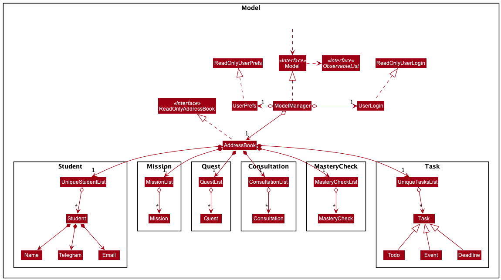

**API** : [`Model.java`](https://github.com/AY2021S1-CS2103T-W11-2/tp/blob/master/src/main/java/seedu/address/model/Model.java)

The `Model`,

* stores a `UserPref` object that represents the user’s preferences.
* stores the address book data.
* exposes an unmodifiable `ObservableList<Person>` that can be 'observed' e.g. the UI can be bound to this list so that the UI automatically updates when the data in the list change.
* does not depend on any of the other three components.

:information_source: **Note:** An alternative (arguably, a more OOP) model is given below. It has a `Tag` list in the `AddressBook`, which `Person` references. This allows `AddressBook` to only require one `Tag` object per unique `Tag`, instead of each `Person` needing their own `Tag` object. 
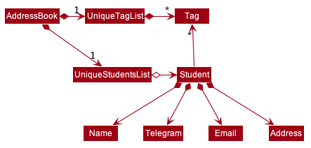

### Storage component

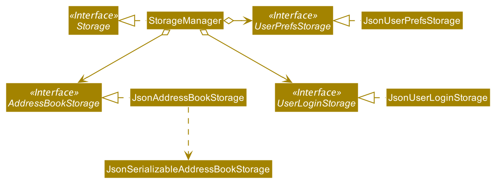

**API** : [`Storage.java`](https://github.com/AY2021S1-CS2103T-W11-2/tp/blob/master/src/main/java/seedu/address/storage/Storage.java)

The `Storage` component,
* can save `UserPref` objects in json format and read it back.
* can save the address book data in json format and read it back.

### Scraper component
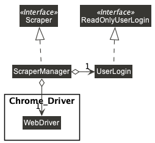

**API** : [`Scraper.java`](https://github.com/AY2021S1-CS2103T-W11-2/tp/blob/master/src/main/java/seedu/address/scraper/Scraper.java)

The `Scraper` component,
* reads user login information from the `UserLogin` object passed to it.
* can scrape `Source Academy`(https://sourceacademy.nus.edu.sg) for course-info such as missions, quests, student names.
* can save the scraped information to `Model`

### Common classes

Classes used by multiple components are in the `seedu.addressbook.commons` package.

--------------------------------------------------------------------------------------------------------------------

## **Implementation**

This section describes some noteworthy details on how certain features are implemented.

### Get Missions Feature
In this section, we will introduce how the `Get Missions Feature` works. We will do so through showing the expected path-execution
and interaction of objects between the `ScraperManager` and `Chrome Driver`.

:information_source: **Note:** Chrome Driver is a web scraper software provided by Google Chrome. It comes packaged with your download of JARVIS.

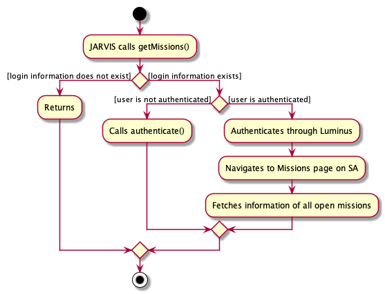

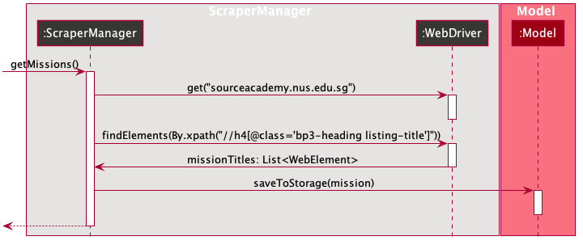

* The strange-looking string within the `XPath.by(...)` is a HTML descriptor for the HTML element that corresponds to each individual mission on SA.
* The `Chrome Driver`, which is of type `WebDriver`, will look for all HTML elements on SA that matches the HTML descriptor we passed in.
* `WebDriver` will return a `List<WebElement>`, with each element in the list corresponding to a single CS1101S mission. This list could of size 0 if there are no active missions that day.

 
:information_source: **Note:** We discussed the workings of the getMissions() method here. In practice, the getStudents() and getQuests() methods work off a similar principle.
 

### View Command
## Structure of View Command

The follow diagram shows the overview of the ViewComamnd Class Diagram:

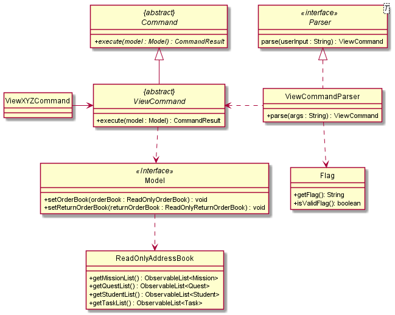

In the `ViewCommand` class, there is also a static message `MESSAGE_USAGE` for when user does not include a second argument since view
has to take in at least one argument. The message will guide the user on what parameters the `ViewCommand` can take in.

In the `ViewCommandParser` class, under the `parse()` method, we reference the `Flag` class which is a class that encapsulates
the different flags that `ViewCommand` can parse. We use the `Flag` class to check for whether an input is valid and go on to parse
the flag and return the correct `ViewCommand` object.

## View Mission Deadlines Feature
In this section, we will introduce how the `View Mission Deadlines Feature` works. The sequence diagram for the View Mission Deadline Command is shown below:

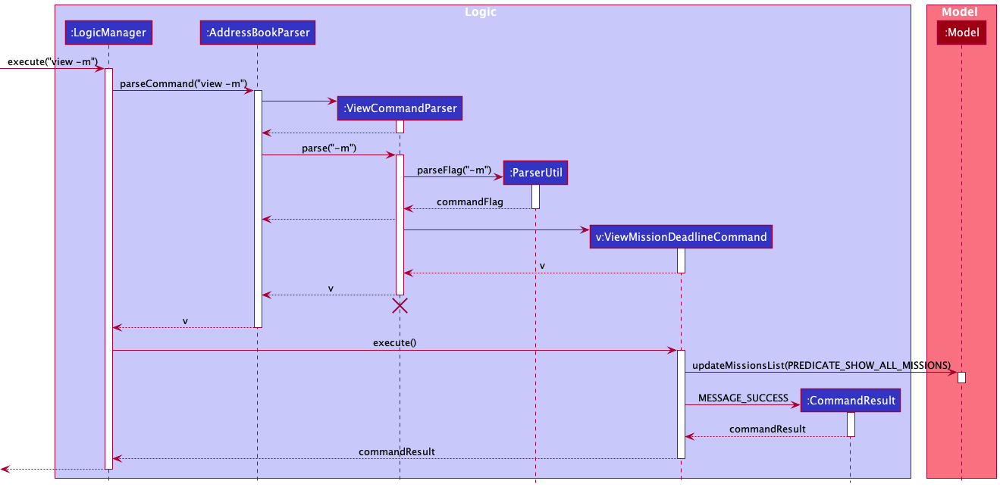

The `LogicManager` will call the `parseCommand` method of `AddressBookParser`, which then passes the second argument to the `ViewCommandParser` object.
The `ViewCommandParser` will return a `ViewMissionDeadlineCommand` object. This object will then be ultimately returned to the `LogicManager`. Next, the `LogicManager` will call the `execute(model)` method using the
`ViewMissionDeadlineCommand` object. In this method, it wil use the `Model` object to call the method : `updateMissionList()`, with parameter `PREDICATE_SHOW_ALL_MISSIONS` which will show all the missions. When completed, the `execute(model)` will return a
`CommandResult` object with the success message to the `LogicManager`, indicating that the command execution is a success.

The View Quest Deadlines features work similarly to this as well.
=======

:information_source: **Note:** We discussed the workings of the getMissions() method here. In practice, the getStudents() and getQuests() methods work off a similar principle.

### View Students Feature
Next, we will introduce how the `View Students Feature` works. The following is a class diagram for View Student
 Commands.

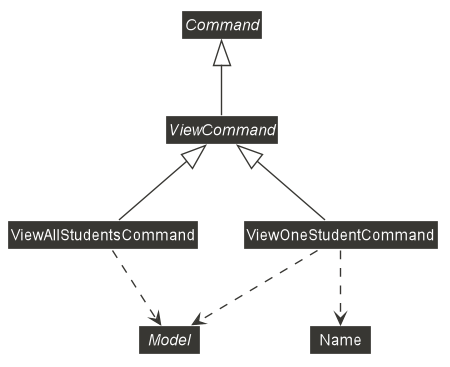
* The abstract class `ViewCommand` extends from the abstract class `Command`
* Both `ViewAllStudentCommand` and `ViewOneStudentCommand` extend from the abstract class `ViewCommand`
* Both `ViewAllStudentCommand` and `ViewOneStudentCommand` take in a Model object for the execute method, as such
 both have a dependency on Model.

Now we will go into how the `View All Students Feature` works, the following is a sequence diagram modelling the
interaction between `ViewAllStudentsCommand`, `Model` and `CommandResult`.
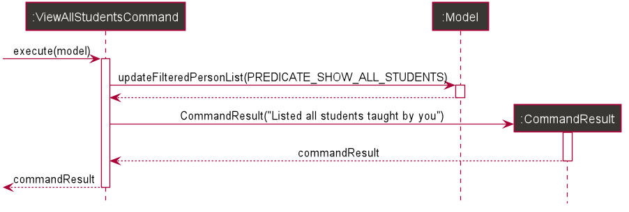

* The `ViewAllStudentsCommand`'s`execute` method is first called with a model passed as an argument.
* `execute` method then calls `Model`'s `updateFilteredPersonList` method with a predicate which shows all students.
* A `CommandResult` object is created with the message "Listed all students taught by you" and returned to
 `ViewALlStudentsCommand`.
* The `CommandResult` object is returned to the caller of `execute`.

### View Tasks Feature
The View Task features involve viewing 4 categories of tasks which work similarly to the above as well. We can choose
to:
* View all `Task` in general,
* View all `Todo`, 
* View all `Event`, or 
* View all `Deadline`.

### View Consultations Feature
Next, we will introduce how the `View Consultations Feature` works. The following is a class diagram for View
Consultations Commands. There are three variants (view all consultations, view past consultations, view future
  consultations) but they all share the same logic.

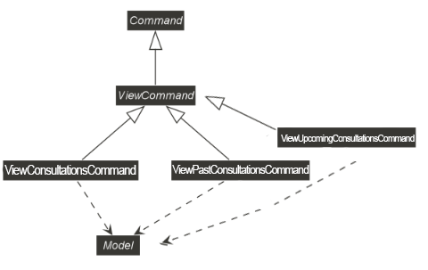
* The abstract class `ViewCommand` extends from the abstract class `Command`
* Both `ViewConsultationCommand` and `ViewPastConsultationCommand` and `ViewUpcomingConsultationCommand` extend
from the abstract class `ViewCommand`
* Both `ViewConsultationCommand` and `ViewPastConsultationCommand` and `ViewUpcomingConsultationCommand` take in a
Model object for the execute method, as such both have a dependency on Model.

Now we will go into how the `View Consultations Feature` works, the following is a sequence diagram modelling the
interaction between `ViewConsultationsCommand`, `Model` and `CommandResult`.
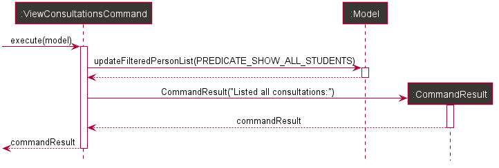

* The `ViewConsultationsCommand`'s`execute` method is first called with a model passed as an argument.
* `execute` method then calls `Model`'s `getConsultations` method with a predicate which shows all consultations of all students.
* A `CommandResult` object is created with the message "Listed all consultations: " and returned to
 `viewAllConsultationsCommand`.
* The `CommandResult` object is returned to the caller of `execute`.

## Structure of Add Command
The following diagram shows the overview of AddCommand Class Diagram:

In the AddCommand class

### Add Task Feature
In this section, we will introduce how the `Add Task Feature` works. We can add 3 different types of tasks, namely
`Todo`, `Event` and `Deadline`.
* `Todo` is a basic simple tasks that is usually not constrained by time; `Event` is
a task that requires completion at a particular point in time; `Deadline` is a task that requires completion before a
particular point in time.

The sequence diagram for the Add Task Command is shown below:
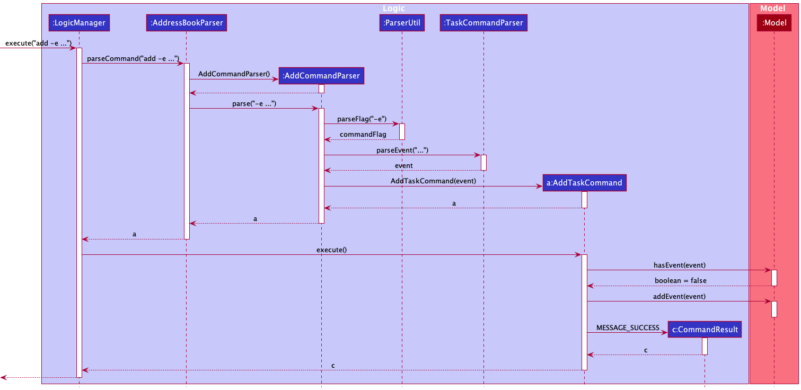

* The `AddCommand`'s`execute` method is first called with a model passed as an argument.
* `execute` method then calls `AddCommandParser`'s `parse` method with a predicate which parses the task.
* A `CommandResult` object is created with the message "Task added"" and returned to `AddCommand`.

--------------------------------------------------------------------------------------------------------------------

## **Documentation, logging, testing, configuration, dev-ops**

* [Documentation guide](Documentation.md)
* [Testing guide](Testing.md)
* [Logging guide](Logging.md)
* [Configuration guide](Configuration.md)
* [DevOps guide](DevOps.md)

--------------------------------------------------------------------------------------------------------------------

## **Appendix: Requirements**

### Product scope

**Target user profile**:

* CS1101S tutor who has to keep track of student submissions and consultations
* can type fast
* prefers typing to mouse interactions
* is reasonably comfortable using CLI apps

**Value proposition**: the only tool to keep tutor todos and responsibilities in check

### User stories

Priorities: High (must have) - `* * *`, Medium (nice to have) - `* *`, Low (unlikely to have) - `*`

| Priority | As a …​                                    | I want to …​                     | So that I …​                                                |
| -------- | ------------------------------------------ | ------------------------------   | ----------------------------------------------------------- |
| `* * *`  | new user                                   | see usage instructions           | can refer to instructions when I forget how to use the App. |
| `* * *`  | user                                       | edit a student                   | can keep the contact details of all my students updated.    |                                                  |
| `* * *`  | user                                       | view my students automatically   | can know who to contact.                                    |
| `* * *`  | user                                       | list all unmarked assignments    | will not miss out on marking any overdue missions or quests.|
| `* * *`  | user                                       | view the deadline of missions or quests  | know when I can start marking them.                 |
| `* *`    | user with a crowded calendar               | add consultations                | keep track of my schedule easily.                           |
| `* *`    | user                                       | list my consultations            | be reminded of my schedule.                                 |
| `* *`    | user                                       | view deadlines for missions and quests | can schedule when to mark them.                       |
| `* *`    | user                                       | add my own tasks                 | can be consolidate all TA and non-TA scheduling into Jarvis.|
| `* *`    | user                                       | list my own tasks                | can have an overview of all my tasks.                       |
| `* *`    | user                                       | mark my tasks as done            | can keep track of complete and incomplete tasks.            |

*{More to be added}*

### Use cases

(For all use cases below, the **System** is `JARVIS` and the **Actor** is the `CS1101S tutor`, unless specified otherwise)

**Use case: UC1 - View consultation sessions**

**MSS**

1.  User requests to view consultations.
2.  Jarvis shows a list of all consultations.

    Use case ends.

**Extensions**

* 1a. The user enters a name with the command.

    * 1a1. Jarvis shows the list of consultation sessions belonging to the student.

      Use case ends.

* 1b. The user enters an invalid name with any command.

    * 1b1. Jarvis shows an error message.

      Use case ends.

* 1c. The user requests to view only past sessions.

    * 1c1. Jarvis shows the list of all past consultation sessions.

      Use case ends.

* 1d. The user requests to view only past sessions with a name.

    * 1d1. Jarvis shows the list of all past consultation sessions belonging to the student.

      Use case ends.

* 1e. The user requests to view only future sessions.

    * 1e1. Jarvis shows the list of all future consultation sessions.

      Use case ends.

* 1f. The user requests to view only future sessions with a name.

    * 1f1. Jarvis shows the list of all future consultation sessions belonging to the student.

      Use case ends.

 **Use case: UC2 - View Mastery Check (MC) sessions**

**MSS**

1.  User requests to view MC sessions.
2.  Jarvis shows a list of all MC sessions.

    Use case ends.

**Extensions**

* 1a. The user enters a name with the command.

    * 1a1. Jarvis shows the list of MC sessions belonging to the student.

      Use case ends.

* 1b. The user enters an invalid name with any command.

    * 1b1. Jarvis shows an error message.

      Use case ends.

* 1c. The user requests to view only past sessions.

    * 1c1. Jarvis shows the list of all past MC sessions.

      Use case ends.

* 1d. The user requests to view only past sessions with a name.

    * 1d1. Jarvis shows the list of all past MC sessions belonging to the student.

      Use case ends.

* 1e. The user requests to view only future sessions.

    * 1e1. Jarvis shows the list of all future MC sessions.

      Use case ends.

* 1f. The user requests to view only future sessions with a name.

    * 1f1. Jarvis shows the list of all future MC sessions belonging to the student.

      Use case ends.

 **Use case: UC3 - Delete a consultation session**

**MSS**

1. User requests to delete a consultation session.
2. Jarvis shows a list of consultation sessions with id numbers.
3. User requests to delete consultation session with id number.
4. Jarvis deletes the consultation session.

    Use case ends.

**Extensions**

* 1a. The user enters a name with the command.

    * 1a1. Jarvis shows the list of consultation sessions belonging to the student.

      Use case resumes at step 3.

* 1b. The user enters an invalid name with the command.

    * 1b1. Jarvis shows an error message.

      Use case ends.

* 2a. The list is empty.

      Use case ends.

* 3a. The given index is invalid.

    * 3a1. Jarvis shows an error message.

      Use case resumes at step 2.

 **Use case: UC4 - Delete a Mastery Check (MC) session**

**MSS**

1. User requests to delete a MC session.
2. Jarvis shows a list of MC sessions with id numbers.
3. User requests to delete MC session with id number.
4. Jarvis deletes the MC session.

    Use case ends.

**Extensions**

* 1a. The user enters a name with the command.

    * 1a1. Jarvis shows the list of MC sessions belonging to the student.

      Use case resumes at step 3.

* 1b. The user enters an invalid name with the command.

    * 1b1. Jarvis shows an error message.

      Use case ends.

* 2a. The list is empty.

      Use case ends.

* 3a. The given index is invalid.

    * 3a1. Jarvis shows an error message.

      Use case resumes at step 2.

 **Use case: UC5 - Add a consultation session**

**MSS**

1. User requests to add a Consultation session.
2. Jarvis adds a Consultation session for the student at the specified date and time.

    Use case ends.

**Extensions**

* 1a. The user enters an invalid date or time.

    * 1a1. Jarvis shows an error message.

      Use case ends.

* 1b. The user enters a nonexistent name.

    * 1b1. Jarvis shows an error message.

      Use case ends.

 **Use case: UC6 - Add a Mastery Check (MC) session**

**MSS**

1. User requests to add a MC session.
2. Jarvis adds a MC session for the student at the specified date and time.

    Use case ends.

**Extensions**

* 1a. The user enters an invalid date or time.

    * 1a1. Jarvis shows an error message.

      Use case ends.

* 1b. The user enters a nonexistent name.

    * 1b1. Jarvis shows an error message.

      Use case ends.

 **Use case: UC7 - Add a personal todo task**

**MSS**

1. User requests to add a personal todo task.
2. Jarvis adds a personal todo task with description.

    Use case ends.

**Extensions**

* 1a. The user enters an invalid command.

    * 1a1. Jarvis shows an error message.

      Use case ends.

* 1b. The user did not enter a description.

    * 1b1. Jarvis shows an error message.

      Use case ends.

 **Use case: UC8 - Add a personal event task**

**MSS**

1. User requests to add a personal event task at the specified time and date.
2. Jarvis adds a personal event task at the specified time and date.

    Use case ends.

**Extensions**

* 1a. The user enters an invalid command.

    * 1a1. Jarvis shows an error message.

      Use case ends.

* 1b. The user did not enter a description.

    * 1b1. Jarvis shows an error message.

      Use case ends.

* 1c. The user enters an invalid date or time.

    * 1c1. Jarvis shows an error message.

      Use case ends.

 **Use case: UC9 - Add a personal deadline task**

**MSS**

1. User requests to add a personal deadline task at the specified time and date.
2. Jarvis adds a personal deadline task at the specified time and date.

    Use case ends.

**Extensions**

* 1a. The user enters an invalid command.

    * 1a1. Jarvis shows an error message.

      Use case ends.

* 1b. The user did not enter a description.

    * 1b1. Jarvis shows an error message.

      Use case ends.

* 1c. The user enters an invalid date or time.

    * 1c1. Jarvis shows an error message.

      Use case ends.

 **Use case: UC10 - Delete a personal task**

**MSS**

1. User requests to delete a personal task.
2. Jarvis shows a list of tasks with id numbers.
3. User requests to delete the task with id number.
4. Jarvis deletes the task.

    Use case ends.

**Extensions**

* 1a. The user knows that he wants to delete a todo task from todo list.

    * 1a1. Jarvis shows the list of todos.

      Use case resumes at step 3.

* 1b. The user knows that he wants to delete an event task from event list.

    * 1b1. Jarvis shows the list of events.

      Use case resumes at step 3.

* 1c. The user knows that he wants to delete a deadline task from deadline list.

    * 1c1. Jarvis shows the list of deadlines.

      Use case resumes at step 3.

* 1d. The user enters an invalid command.

    * 1d1. Jarvis shows an error message.

      Use case ends.

* 2a. The list is empty.

      Use case ends.

* 3a. The given index is invalid.

    * 3a1. Jarvis shows an error message.

      Use case resumes at step 2.

 **Use case: UC11 - View personal tasks**

**MSS**

1.  User requests to view his personal tasks.
2.  Jarvis shows a list of tasks.

    Use case ends.

**Extensions**

* 1a. The user only wants to view todo tasks.

    * 1a1. Jarvis shows todo task list.

      Use case ends.

* 1b. The user only wants to view event tasks.

    * 1a1. Jarvis shows event task list.

      Use case ends.

* 1c. The user only wants to view deadline tasks.

    * 1a1. Jarvis shows deadline task list.

      Use case ends.

* 1d. The user enters an invalid command.

    * 1b1. Jarvis shows an error message.

      Use case ends.

 **Use case: UC12 - Mark a personal task as done**

**MSS**

1. User requests to mark a personal task as done.
2. Jarvis shows a list of tasks with id numbers.
3. User requests to mark the task with id number as done.
4. Jarvis marks the task as done.

**Extensions**

* 1a. The user knows that he wants to mark a todo task from todo list as done.

    * 1a1. Jarvis shows the list of todos.

      Use case resumes at step 3.

* 1b. The user knows that he wants to mark an event task from event list as done.

    * 1b1. Jarvis shows the list of events.

      Use case resumes at step 3.

* 1c. The user knows that he wants to mark a deadline task from deadline list as done.

    * 1c1. Jarvis shows the list of deadlines.

      Use case resumes at step 3.

* 1d. The user enters an invalid command.

    * 1d1. Jarvis shows an error message.

      Use case ends.

* 2a. The list is empty.

      Use case ends.

* 3a. The given index is invalid.

    * 3a1. Jarvis shows an error message.

      Use case resumes at step 2.

 **Use case: UC13 - Closes the Jarvis program**

**MSS**

1. The user finishes using Jarvis program.
2. The user proceeds to close the program.

    Use case ends.

**Extensions**

* 1a. The user forgets to close the program.

    * 1a1. Jarvis continues to run.

    Use case ends.

### Non-Functional Requirements

1.  Should work on _mainstream Operating System_ as long as it has Java `11` or above installed.
2.  Should be able to hold up to 1000 students without a noticeable sluggishness in performance for typical usage.
3.  A user with above average typing speed for regular English text (i.e. not code, not system admin commands) should be able to accomplish most of the tasks faster using commands than using the mouse.
4. The system should be backward compatible with data produced by earlier versions of the system.
5. The system should work on both 32-bit and 64-bit environments.
6. The system should respond within one second.
7. For now, the product is not required to handle the printing of reports.
8. The application should not use copyrighted images anywhere in the UI.
9.  Should be easy for the user to migrate all information in Jarvis onto a separate computer.

### Glossary

* **Mainstream Desktop Operating System**: Windows, Linux, Unix, OS-X
* **Private contact detail**: A contact detail that is not meant to be shared with others
* **Mastery Check**: Type of special consultation that is recorded and graded in the CS1101S module.

--------------------------------------------------------------------------------------------------------------------

## **Appendix: Instructions for manual testing**

Given below are instructions to test the app manually.

:information_source: **Note:** These instructions only provide a starting point for testers to work on;
testers are expected to do more *exploratory* testing.

### Launch and shutdown

1. Initial launch

   1. Download the jar file and copy into an empty folder

   1. Double-click the jar file Expected: Shows the GUI with a set of sample contacts. The window size may not be optimum.

1. Saving window preferences

   1. Resize the window to an optimum size. Move the window to a different location. Close the window.

   1. Re-launch the app by double-clicking the jar file. 
       Expected: The most recent window size and location is retained.

1. _{ more test cases …​ }_

### Deleting a student

1. Deleting a student while all students are being shown

   1. Prerequisites: List all students using the `list` command. Multiple students in the list.

   1. Test case: `delete 1` 
      Expected: First contact is deleted from the list. Details of the deleted contact shown in the status message. Timestamp in the status bar is updated.

   1. Test case: `delete 0` 
      Expected: No student is deleted. Error details shown in the status message. Status bar remains the same.

   1. Other incorrect delete commands to try: `delete`, `delete x`, `...` (where x is larger than the list size) 
      Expected: Similar to previous.

1. _{ more test cases …​ }_

### Saving data

1. Dealing with missing/corrupted data files

   1. _{explain how to simulate a missing/corrupted file, and the expected behavior}_

1. _{ more test cases …​ }_
