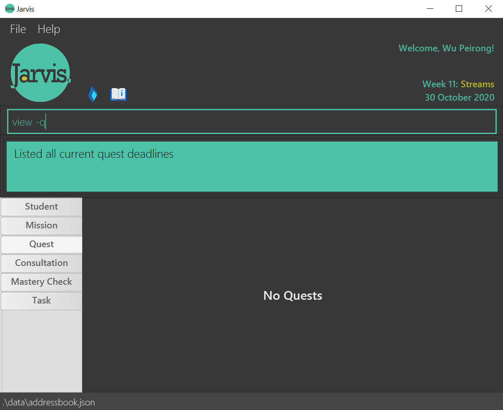

## User Guide

Jarvis is a desktop app for CS1101S Teaching Assistants (Avengers), optimized for use via a Command Line Interface (CLI) while still having the benefits of a Graphical User Interface (GUI). If you can type fast, Jarvis can get your TA administrative tasks done faster than traditional GUI apps.

## Table of Contents

1. [Overview](#1-overview)
    - [1.1 Introduction](#11-introduction)
    - [1.2 Purpose](#12-purpose)
2. [About the User Guide](#2-about-the-user-guide)
3. [Quick Start](#3-quick-start)
4. [Navigating Jarvis](#4-navigating-jarvis)
    - [4.1 UI Layout](#41-ui-layout)
5. [Logging into Jarvis](#5-logging-into-jarvis)
6. [Features](#6-features)
    - [6.1 General Notes about Command Format](#61-general-notes-about-command-format)
    - [6.2 Viewing help : `help`](#62-viewing-help--help)
    - [6.3 Adding Information : `add`](#63-adding-information--add)
        * [6.3.1 Adding Todos : `add -t`](#631-adding-todos--t)
        * [6.3.2 Adding Events : `add -e`](#632-adding-events---e)
        * [6.3.3 Adding Deadlines : `add -d`](#633-adding-deadlines---d)
        * [6.3.4 Adding Consultations : `add -c`](#634-adding-consultations---c)
        * [6.3.5 Adding Mastery Checks : `add -mc`](#635-adding-mastery-checks---mc)
    - [6.4 Editing Information : `edit`](#64-editing-information--edit)
        * [6.4.1 Editing Login Information : `edit -l`](#641-editing-login-information---l)
        * [6.4.2 Editing Student Information : `edit -s`](#642-editing-student-information---s)
        * [6.4.3 Editing Mastery Checks : `edit -mc`](#643-editing-mastery-checks---mc)
    - [6.5 Deleting Information : `delete`](#65-deleting-information--delete)
        * [6.5.1 Deleting Tasks : `delete -t`](#651-deleting-tasks---t)
        * [6.5.2 Deleting Consultations : `delete -c`](#652-deleting-consultations---c)
        * [6.5.3 Deleting Mastery Checks : `delete -mc`](#653-deleting-mastery-checks---mc)
    - [6.6 Viewing Information : `view`](#66-viewing-information--view)
        * [6.6.1 Viewing a list of all students : `view -s`](#661-viewing-a-list-of-all-students---s)
        * [6.6.2 Viewing one student : `view -s NAME`](#662-viewing-one-student---s-name)
        * [6.6.3 Viewing all consultation sessions : `view -c`](#663-viewing-all-consultation-sessions---c)
        * [6.6.4 Viewing past consultation sessions: `view -cp`](#664-viewing-past-consultation-sessions---cp)
        * [6.6.5 Viewing upcoming consultation sessions: `view -cu`](#665-viewing-upcoming-consultation-sessions---cu)
        * [6.6.6 Viewing all Mastery Check sessions: `view -mc`](#666-viewing-all-mastery-check-sessions---mc)
        * [6.6.7 Viewing past Mastery Check sessions: `view -mcp`](#667-viewing-past-mastery-check-sessions--mcp)
        * [6.6.8 Viewing upcoming Mastery Check sessions: `view -mcu`](#668-viewing-upcoming-mastery-check-sessions--mcu)
        * [6.6.9 Viewing deadline for missions: `view -m`](#669-viewing-deadline-for-missions---m)
        * [6.6.10 Viewing deadline for quests: `view -q`](#6610-viewing-deadline-for-quests---q)
        * [6.6.11 Viewing ungraded missions: `view -um`](#6611-viewing-ungraded-missions---um)
        * [6.6.12 Viewing ungraded quests: `view -uq`](#6612-viewing-ungraded-quests---uq)     
        * [6.6.13 Viewing all Tasks: `view -t`](#6613-viewing-all-tasks---t)
        * [6.6.14 Viewing all Todos: `view -tt`](#6614-viewing-all-todos---tt)
        * [6.6.15 Viewing all Events: `view -te`](#6615-viewing-all-events---te)
        * [6.6.16 Viewing all Deadlines: `view -td`](#6616-viewing-all-deadlines---td)
    - [6.7 Exiting the program: `exit`](#67-exiting-the-program--exit)
    - [6.8 Saving the data](#668-viewing-upcoming-mastery-check-sessions--mcu)
7. [Command Summary](#7-command-summary)
    - [7.1 Add Command Summary](#71-add-command-summary)
    - [7.2 Edit Command Summary](#72-edit-command-summary)
    - [7.3 Delete Command Summary](#73-delete-command-summary)
    - [7.4 View Command Summary](#74-view-command-summary)
    - [7.5 Exit Command Summary](#75-exit-command-summary)
    - [7.6 Help Command Summary](#76-help-command-summary)
8. [Glossary](#8-glossary)
    - [8.1 Difference Between Consultations and Mastery Checks](#81-difference-between-consultations-and-mastery-checks)
9. [FAQ](#9-faq)

--------------------------------------------------------------------------------------------------------------------

## 1. Overview

### 1.1 Introduction
Jarvis is a desktop app for CS1101S Teaching Assistants (Avengers), optimized for use via a Command Line Interface (CLI)
while still having the benefits of a Graphical User Interface (GUI). Jarvis in general helps to organise and simplify
CS1101S tutors' administrative tasks.

### 1.2 Purpose
As an Avenger, not only do you have immense power but you are also burdened with inevitable great responsibility.
Not to worry, Jarvis is here to empower you to manage your personal tasks while teaching others efficiently and
effectively.

--------------------------------------------------------------------------------------------------------------------

## 2. About the User Guide
This section aims to remind you of the important parts to take note of while reading the user guide.

--------------------------------------------------------------------------------------------------------------------

## 3. Quick start
(Everyone)

1. Ensure you have Java 11 or above installed in your Computer.

1. Download the latest _jarvis.jar_ and your operating system's _Chrome Driver_ from [here](https://github.com/AY2021S1-CS2103T-W11-2/tp/releases/tag/v1.3).
It is crucial to have the Chrome Driver in order for Jarvis to start up, if the GUI does not launch,
Please check that you have installed the correct driver
    1. Windows: chromedriver.exe
    1. MacOS: chromedriver_mac
    1. Linux: chromedriver_linux

1. Copy both files to the folder you want to use as the _home folder_ for your Jarvis.

1. There are two options for launching Jarvis.
    1. Double-click the `jarvis.jar` file to start the app.
    1. Launch Jarvis from the the Windows Command Prompt or MacOS
    command line by navigating to the directory containing jarvis.jar,
    then typing the command `java -jar jarvis.jar`

    A GUI similar to the screenshot below should appear in a few seconds.

   

1. Upon start up, you will be prompted to log in to unlock Jarvis's
 full set of features.
 Please refer to the logging in segment below to complete your log in.

1. Type the command in the command box and press Enter to execute it. e.g. typing help and pressing Enter will open the help window.
   Some example commands you can try:
   * `view -s:  Lists all students. `
   * `view -s John Doe: Lists information about a student named John Doe.`
   * `add -t DESCRIPTION : Adds a todo task with specified description.`
   * `edit -t TASK_ID : Marks the task referenced by Task_ID as Done.`
   * `exit : Exits the app.`

1. Refer to the Features below for details of each command.

--------------------------------------------------------------------------------------------------------------------

## 4. Navigating Jarvis
(Everyone)

Jarvis has a Graphical User Interface centered around a command input box on the top, surrounded by a light green
line. The green box below the command input box is the user feedback box. Jarvis provides feedback to the user through
this box.

### 4.1 UI Layout
(Everyone)
 
   * The user interface is split into clearly marked tabs: `Student`, `Mission`, `Quest`, `Consultation`, `Mastery Check`, `Task`.
 
   * Clicking on each tab will give you the information you require for that field.

The core features are based on Students, Missions, Quests, Consultations, Mastery Checks and Tasks.
Each core feature has a tab for the organisation of its information.

To navigate the features, there are 2 methods which could be used individually, or mixed. We have designed
this flexibility with you, the user in mind.
 1. Only inputting commands into the box annotated "Enter command here..".
 1. Clicking on the tabs.

--------------------------------------------------------------------------------------------------------------------

## 5. Logging into Jarvis

The following is the prompt upon first log in, you are prompted to key in your Sourceacademy username and password:

To log in, simply edit your log in details with the following command:
 **Format: `edit -l u/LUMINUS_USERNAME p/LUMINUS_PASSWORD`**
 Examples:
* `edit -l u/nusstu\e1234567 p/testpassword`

An example of the command being inputted:

Within the green rectangle box, Jarvis will notify you if the log in was successful. Upon success, all information from
 sourceacademy will be visible
 to you.

--------------------------------------------------------------------------------------------------------------------

## 6. Features

### 6.1 General Notes about Command Format

   * Words in UPPER_CASE are the parameters to be supplied by you.
     e.g. in `add -t DESCRIPTION`, `DESCRIPTION` is a parameter which can be used as `add -t Mark Missions`.

   * Items in square brackets are optional.
     e.g `view -s [NAME]`, name is an optional parameter. It can be used as `view -s` or as `view -s [John]`.

   * Parameters can be in any order.
     e.g. if the command specifies `t/TELEGRAM e/EMAIL`, `e/EMAIL t/TELEGRAM` is also acceptable.

   * Commands with arrows indicate a multi-step process.
     e.g. `delete -c → 1` means that you should enter `delete -c` first and then `1` after the prompt
   has been processed.

**Notes about Jarvis' relationship with Sourceacademy:** (Peirong)  
* Students’ names that are under the Avenger will be fetched automatically from sourceacademy.nus.edu.sg upon startup.
* Luminus username and passwords will be stored in plaintext.

### 6.2 Viewing help : `help`

Shows a message explaining how to access the help page.
 **Format: `help`**

### 6.3 Adding Information : `add`

#### General Notes on Tasks

Each `Task` you create, be it `Todo`, `Event` or `Deadline`, there will be an unique ID assigned to each of them, so
that there will be no 2 of the same Task ID in your Task List at any point of Time. The Task ID is reflected as
 eg. D1, E5, T21
The first alphabet "T", "E" and "D" refers to `Todo`, `Event`, and `Deadline` respectively, and the number followed
after the alphabet is the Task Number, which refers to the index of the `Task` you created with respect to all the
`Task` you ever created.

#### 6.3.1 Adding Todos `-t`

Adds your personal `Todo` with a `description`.

 **Format: `add -t DESCRIPTION`**
 Examples:
* `add -t Clear the bin`
* `add -t Return calculator to Mary`

#### 6.3.2 Adding Events : `-e`

Adds your personal `Event` with a `description`, to attend at a specific `date` and `time`.

 **Format: `add -e DESCRIPTION d/YYYY-MM-DD t/HH:MM`**
 Examples:
* `add -e John’s birthday party d/2020-09-21 t/20:00`
* `add -e CS2103T team meeting d/2020-09-27 t/10:30`

An `Event` requires extra `date` and `time` specifications in order to create.

#### 6.3.3 Adding Deadlines : `-d`

Adds your personal `Deadline` with a `description`, to complete by a specific `date` and `time`.

 **Format: `add -d DESCRIPTION d/YYYY-MM-DD t/HH:MM`**
 Examples:
* `add -d CS2103T Week 5 ip tasks d/2020-09-08 t/23:59`
* `add -d Research project report d/2020-10-05 t/10:30`

Similar to `Event`, a `Deadline` requires extra `date` and `time` specifications in order to create.

#### 6.3.4 Adding Consultations : `-c`

Adds a `Consultation` session with a `Student` at a specific `date` and `time`.
 **Format: `add -c NAME d/YYYY-MM-DD t/HH:MM`**
 Examples:
* `add -c John Doe d/2020-09-20 t/13:30`
* `add -c Mary Jane d/2021-01-02 t/09:15`

#### 6.3.5 Adding Mastery Checks : `-mc`

Adds a `Mastery Check` session with a `Student` at a specific `date` and `time`.
 **Format: `add -mc NAME d/YYYY-MM-DD t/HH:MM`**
 Examples:
* `add -mc John Doe d/2020-09-20 t/13:30`
* `add -mc Mary Jane d/2021-01-02 t/09:15`

### 6.4 Editing Information : `edit`

#### 6.4.1 Editing Login Information : `-l`

Similar to the format for editing students above, you can use tags to specify the field to be edited.
 **Format: `edit -l u/LUMINUS_USERNAME p/LUMINUS_PASSWORD`**
 Examples:
* `edit -l u/nusstu\e1234567 p/testpassword`
* `edit -l p/testpassword`

 Notes:
* Do note that it takes a load time of around ~5 seconds after entering this command for the changes from Sourceacademy to be reflected in the GUI.
* After the students, missions and quests have loaded, take note that the `Telegram` and `Email` fields of the student are placeholder values.
* This is because SA does not contain these 2 fields of any student. Editing the student details will save the updated values. 

#### 6.4.2 Editing Student Information : `-s`
 **Format: `edit -s INDEX n/NAME t/TELEGRAM e/EMAIL`**
 Examples:
* `edit -s 1 e/koolguy@gmail.com t/handsome`
* `edit -s 3 n/Timots`

#### 6.4.2 Editing Mastery Checks : `-mc`
(Eryn)

Edits the score of a `Mastery Check` session with a `Student`.
 **Format: `edit -mc INDEX s/SCORE`**
 Examples:
* `edit -s 1 s/0`
* `edit -s 3 s/1`

Do note that the SCORE parameter can only be 0 or 1, according to the actual restrictions of mastery check pass/fail in CS1101S.

### 6.5 Deleting Information : `delete`

#### 6.5.1 Deleting Tasks : `-t`

Deletes a task based on the `TASK_ID` you specify.

 **Format:`delete -t TASK_ID`**
 Examples:
* `delete -t T3`
* `delete -t D2`

#### 6.5.2 Deleting Consultations : `-c`

Shows a list of `Consultations` with `id numbers` so that you can specify which session you want to delete.
 **Format: `delete -c`**
 Examples:
* `delete -c
   → 3`

#### 6.5.3 Deleting Mastery Checks : `-mc`

Similar to the above process of deleting consultations, deleting `Mastery Checks` first
shows a list of `Mastery Checks` with `id numbers` so that you can specify which session you want to delete.
 **Format: `delete -mc`**
 Examples:
* `delete -mc → 3`

### 6.6 Viewing Information : `view`

#### 6.6.1 Viewing a list of all students : `-s`

Shows a list of all students under the tutor in JARVIS.
Please take note of the command inputted into the command box to understand how the respective commands are inputted.

 **Format: `view -s`**

#### 6.6.2 Viewing one student : `-s [NAME]`

Shows a specific student if a student name is entered after the command, Jarviss.

 **Format: `view -s [NAME]`**
 Examples:
* `view -s John Doe`

#### 6.6.3 Viewing all consultation sessions : `-c`

Shows all `confirmed consultation` sessions, both past and upcoming.
 **Format: `view -c`**
 Examples:
* `view -c`

#### 6.6.4 Viewing past consultation sessions : `-cp`

Shows all `past consultation` sessions.
 **Format: `view -cp`**
 Examples:
* `view -cp`

#### 6.6.5 Viewing upcoming consultation sessions : `-cu`

Shows all `upcoming consultation` sessions.
 **Format: `view -cu`**
 Examples:
* `view -cu`

#### 6.6.6 Viewing all Mastery Check sessions : `-mc`

Shows all `confirmed MC` sessions, both past and upcoming.
 **Format: `view -mc`**
 Examples:
* `view -mc`

#### 6.6.7 Viewing past Mastery Check sessions : `mcp`

Shows all `past MC` sessions.
 **Format: `view -mcp`**
 Examples:
* `view -mcp`

#### 6.6.8 Viewing upcoming Mastery Check sessions : `mcu`

Shows all `upcoming MC` sessions.
 **Format: `view -mcu`**
 Examples:
* `view -mcu`

#### 6.6.9 Viewing deadline for missions : `-m`

Shows the deadline for the current mission(s).
 **Format: `view -m`**

You may also click on the `Mission` tab to do so.

#### 6.6.10 Viewing deadline for quests : `-q`

Shows the deadline for the current quest(s).
 **Format: `view -q`**

You may also click on the `Quest` tab to do so.

#### 6.6.11 Viewing ungraded missions : `-um`

Shows the missions that you have not yet graded.

 **Format: `view -um`**

#### 6.6.12 Viewing ungraded quests : `-uq`

Shows the quests that you have not yet graded.

 **Format: `view -uq`**

#### 6.6.13 Viewing all Tasks : `-t`

Shows the list of all your current tasks.
 **Format: `view -t`**

#### 6.6.14 Viewing all Todos : `-tt`

Shows the list of all your current todos.
 **Format: `view -tt`**

#### 6.6.15 Viewing all Events : `-te`

Shows the list of all your current events.
 **Format: `view -te`**

#### 6.6.16 Viewing all Deadlines : `-td`

Shows the list of all your current deadlines.
 **Format: `view -td`**

### 6.7 Exiting the program : `exit`

Exits the program.
 **Format: `exit`**

### 7.7 Saving the data

JARVIS data are saved in the file `jarvis.json` automatically after any command that changes the data. There is no need to save manually.

Note that only `Student`, `Consultation`, `Mastery Check` and `Task` data are saved to the hard drive since `Mission` and `Quest` data
are likely to change frequently.

--------------------------------------------------------------------------------------------------------------------

## 7. Command Summary

### 7.1 Add Command Summary

| Function | Tag | Format, Examples |
| -------- | --- | ---------------- |
| Add Todo | -t | add -t DESCRIPTION |
| Add Event | -e | add -e DESCRIPTION d/YYYY-MM-DD t/HH:MM |
| Add Deadline | -d | add -d DESCRIPTION d/YYYY-MM-DD t/HH:MM |
| Add Consultation | -c | add -c NAME d/YYYY-MM-DD t/HH:MM |
| Add Mastery Check | -mc | add -c NAME d/YYYY-MM-DD t/HH:MM |

### 7.2 Edit Command Summary

| Function | Tag | Format, Examples |
| -------- | --- | ---------------- |
| Edit Login details | -l | edit -l u/LUMINUS_USERNAME p/LUMINUS_PASSWORD |
| Edit Student details | -s | edit -s INDEX n/NAME t/TELEGRAM e/EMAIL |

### 7.3 Delete Command Summary

| Function | Tag | Format, Examples |
| -------- | --- | ---------------- |
| Delete Task | -t | delete -t TASK_ID |
| Delete Consultation | -c | delete -c NAME  E.g. delete -c → 3 / delete -c John Doe → 2 |
| Delete Mastery Check | -mc | delete -mc NAME  E.g. delete -mc → 3 / delete -mc John Doe → 2 |

### 7.4 View Command Summary

| Function | Tag | Format, Examples |
| -------- | --- | ---------------- |
| View one Student | -s | view -s NAME |
| View all Consultations | -c | view -c NAME  E.g. view -c / view -c John Doe |
| View all Past Consultations | -cp | view -cp NAME  E.g. view -cp, view -cp John Doe |
| View all Upcoming Consultations | -cu | view -cu NAME  E.g. view -cu / view -cu John Doe |
| View all Mastery Checks | -mc | view -mc |
| View all Past Mastery Checks | -mcp | view -mcp |
| View all Upcoming Mastery Checks | -mcu | view -mcu  |
| View Deadlines for Missions | -m | view -m |
| View Deadlines for Quests | -q | view -q |
| View Ungraded Missions | -um | view -um |
| View Ungraded Quests | -uq | view -uq |
| View all Tasks | -t | view -t |
| View all Todos | -tt | view -tt |
| View all Events | -te | view -te |
| View all Deadlines | -td | view -td |

### 7.5 Exit Command Summary

| Function | Format, Examples |
| -------- | ---------------- |
| Exits program | `exit` |

### 7.6 Help Command Summary

| Function | Format, Examples |
| -------- | ---------------- |
| Provide help with program commands | `help` |

## 8. Glossary
### 8.1 Difference Between Consultations and Mastery Checks
Mastery Checks are a specific type of consultations that is mandatory and graded in CS1101S, unlike normal consultations, and thus are displayed in separate tabs in Jarvis.

## 9. FAQ

`Q: How do I transfer my data to another Computer?`
 `A: Install the app in the other computer and overwrite the empty data file(.txt file) it creates with the file(.txt file) that contains the data of your previous JARVIS home folder.`
