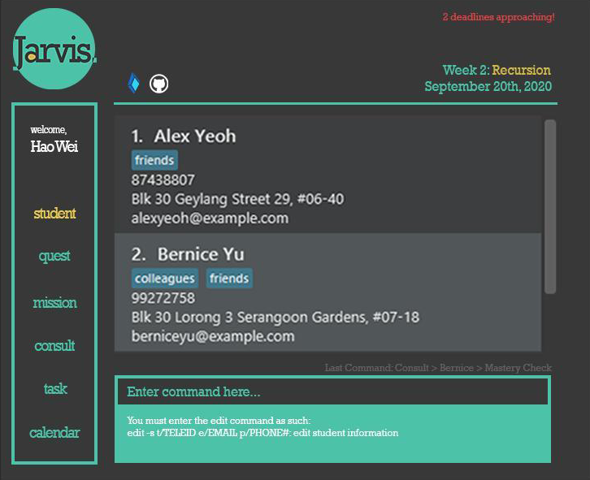

## User Guide

JARVIS is a desktop app for CS1101S Teaching Assistants (Avengers), optimized for use via a Command Line Interface (CLI) while still having the benefits of a Graphical User Interface (GUI). If you can type fast, JARVIS can get your TA administrative tasks done faster than traditional GUI apps.

### Table of Contents

* Quick start
* Features
    * Viewing help: `help`
    * Adding information: `add`
      * Adding Todos: `-t`
      * Adding Events: `-e`
      * Adding Deadlines: `-d`
      * Adding Consultations: `-c`
      * Adding Mastery Checks: `-mc`
  * Editing information: `edit`
    * Marking Tasks as Done: `-t`, `-tt`, `-te`, `td`
    * Editing Student Information: `-s`
  * Deleting information: `delete`
    * Deleting Tasks (Todos, Events, Deadlines): `-t`, `-tt`, `-te`, `-td`
    * Deleting Consultations: `-c`
    * Deleting Mastery Checks: `-mc`
  * Vewing information: `view`
    * Viewing Student Information: `-s`
    * Viewing Consultation sessions: `-c`, `-cp`, `-cu`
    * Viewing Mastery Check sessions: `-mc`, `mcp`, `-mcu`
    * Viewing ungraded missions and quests: `-u`
    * Viewing deadline for missions: `-m`
    * Viewing deadline for quests: `-q`
    * Viewing deadline for both missions and quests: `-b`
    * Viewing deadline for specific mission/quest by id: `-i`
    * Viewing Tasks (Todos, Events, Deadlines): `-t`, `-tt`, `-te`, `-td`
  * Exiting the program: `exit`
  * Saving the data
* FAQ
* Command summary
--------------------------------------------------------------------------------------------------------------------

## Quick start

1. Ensure you have Java 11 or above installed in your Computer.

1. Download the latest JARVIS.jar from [here](https://github.com/se-edu/addressbook-level3/releases).

1. Copy the file to the folder you want to use as the _home folder_ for your JARVIS.

1. Double-click the file to start the app. The GUI similar to the below should appear in a few seconds. Note how the app contains some sample data. 
   

1. Type the command in the command box and press Enter to execute it. e.g. typing help and pressing Enter will open the help window.
   Some example commands you can try:
   * `view -s:  Lists all students. `
   * `view -s John Doe: Lists information about a student named John Doe.`
   * `add -t DESCRIPTION : Adds a todo task with specified description.`
   * `edit -t TASK_ID : Marks the task referenced by Task_ID as Done.`
   * `exit : Exits the app.`

1.  Refer to the Features below for details of each command.
--------------------------------------------------------------------------------------------------------------------

## Features

**Notes about the command format:** 
   * Words in UPPER_CASE are the parameters to be supplied by you.
     e.g. in `add n/NAME`, `NAME` is a parameter which can be used as add n/John Doe.

   * Items in square brackets are optional.
     e.g `n/NAME [t/TAG]` can be used as `n/John Doe t/friend` or `as n/John Doe`.

   * Items with …​ after them can be used multiple times including zero times.
     e.g. `[t/TAG]…​` can be used as ` ` (i.e. 0 times), `t/friend`, `t/friend t/family` etc.

   * Parameters can be in any order.
     e.g. if the command specifies `n/NAME p/PHONE_NUMBER`, `p/PHONE_NUMBER n/NAME` is also acceptable.

   * Commands in parentheses are optional.
     e.g. if the command specifies `add -c (NAME)`, name is an optional parameter.

   * Commands with arrows indicate a multi-step process.
     e.g. `delete -c → 1` means that the user should enter `delete -c` first and then `1` after the prompt has
    been processed.`

**Notes about student information in JARVIS:** 
Students’ names that are under the Avenger using JARVIS will be fetched automatically from sourceacademy.nus.edu.sg upon startup.

### 1. Viewing help : `help`

Shows a message explaining how to access the help page.
 **Format: `help`**

### 2. Adding Information: `add`

#### 2-1. Adding Todos: `add -t`
Adds a  simple todo with a todo description.
 **Format: `add -t DESCRIPTION`**
 Examples:
* `add -t Clear the bin`
* `add -t Return calculator to Mary`

#### 2-2. Adding Events: `add -e`
Adds an event with an event description to attend at a specific date and time.
 **Format: `add -e DESCRIPTION d/YYYY-MM-DD t/HH:MM`**
 Examples:
* `add -e John’s birthday party d/2020-09-21 t/20:00`
* `add -e CS2103T team meeting d/2020-09-27 t/10:30`

#### 2-3. Adding Deadlines: `add -d`
Adds a deadline with an deadline description to complete by a specific date and time.
 **Format: `add -d DESCRIPTION d/YYYY-MM-DD t/HH:MM`**
 Examples:
* `add -d CS2103T Week 5 ip tasks d/2020-09-08 t/23:59`
* `add -d Research project report d/2020-10-05 t/10:30`

#### 2-4. Adding Consultations: `add -c`
Adds a consultation session with a student at a specific date and time.
 **Format: `add -c NAME d/YYYY-MM-DD t/HH:MM`**
 Examples:
* `add -c John Doe d/2020-09-20 t/13:30`
* `add -c Mary Jane d/2021-01-02 t/09:15`

#### 2-5. Adding Mastery Checks: `add -mc`
Adds a Mastery Check session with a student at a specific date and time.
 **Format: `add -mc NAME d/YYYY-MM-DD t/HH:MM`**
 Examples:
* `add -mc John Doe d/2020-09-20 t/13:30`
* `add -mc Mary Jane d/2021-01-02 t/09:15`

### 3. Editing Information: `edit`

#### 3-1. Editing Student Information: `edit -s`
Include tags followed by the updated information such as `t/maryjane132` or `e/e1234222@u.nus.edu` to edit the
information which corresponds to that tag. tags together with the updated information have to be in the specified order.
 **Format: `edit -s NAME t/TELEGRAM_ID e/EMAIL s/PARTICIPATION_SCORE`**
 Examples:
* `edit -s John Doe t/johndoe132 e/e1234567@u.nus.edu`
* `edit -s Mary Jane t/maryjane132 s/3`

#### 3-2. Marking Tasks as Done: `edit -t`
Shows a list of tasks (todos, events, deadlines) with id numbers. If `-t` is specified by user, all tasks regardless of their category will be listed. If `-tt`, `-te` or `-td` is specified, todo list, event list or deadline list will be shown respectively. Then, user can specify the `TASK_ID` to mark that particular task as done.
 **Format: `edit -t / -tt / -te / -td → TASK_ID`**
 Examples:
* `edit -t → 3`
* `edit -te → 2`

### 4. Deleting Information: `delete`
#### 4-1. Deleting Tasks: `delete -t`
Shows a list of tasks (todos, events, deadlines) with id numbers. If `-t` is specified by user, all tasks regardless of their category will be listed. If `-tt`, `-te` or `-td` is specified, todo list, event list or deadline list will be shown respectively. Then, user can sepcify the `TASK_ID` to delete that particular task.
  **Format:`delete -t / -tt / -te / -td → TASK_ID`**
 Examples:
* `delete -t → 3`
* `delete -td → 2`

#### 4-2 Deleting Consultations: `delete -c`
Shows a list of consultations with id numbers which can be entered by the user to specify and delete a session. If a student name is entered after the command, it shows only the sessions with the specific student.
 **Format: delete -c [NAME]**
 Examples:
* `delete -c
   → 3`
* `delete -c John Doe
   → 2`

#### 4-3. Deleting Mastery Checks: `delete -mc`
Shows a list of Mastery Checks with id numbers which can be entered by the user to specify and delete a session. If a student name is entered after the command, it shows only the sessions with the specific student.
 **Format: delete -mc [NAME]**
 Examples:
* `delete -mc → 3`
* `delete -mc John Doe
   → 2`

### 5. Viewing Information: `view `
Shows a list of all students under the tutor in JARVIS.
 **Format: `view`**

#### 5-1 Viewing a list of all students: `view -s`
Shows a list of all students under the tutor in JARVIS. If a student name is entered after the command, it shows all
 details (contact information, consultation requests and studio participation marks) of a specific student.
 **Format: `view -s [NAME]`**

#### 5-2. Viewing all consultation sessions: `view -c`

Shows all confirmed consultation sessions, both past and upcoming. If a student name is entered after the command, it shows consultation sessions confirmed with the specific student.
 **Format: `view -c [NAME]`**
 Examples:
* `view -c`
* `view -c John Doe`

#### 5-3. Viewing past consultation sessions: `view -cp`

Shows all past consultation sessions. If a student name is entered after the command, it shows past consultation sessions with the specific student.
 **Format: `view -cp [NAME]`**
 Examples:
* `view -cp`
* `view -cp John Doe`

#### 5-4. Viewing upcoming consultation sessions: `view -cu`

Shows all upcoming consultation sessions. If a student name is entered after the command, it shows upcoming consultation sessions with the specific student.
 **Format: `view -cu [NAME]`**
 Examples:
* `view -cu`
* `view -cu John Doe`

#### 5-5. Viewing all Mastery Check sessions: `view -mc`

Shows all confirmed MC sessions, both past and upcoming. If a student name is entered after the command, it shows sessions confirmed with the specific student.
 **Format: `view -mc [NAME]`**
 Examples:
* `view -mc`
* `view -mc John Doe`

#### 5-6. Viewing past Mastery Check sessions: `view -mcp`

Shows all past MC sessions. If a student name is entered after the command, it shows past sessions with the specific student.
 **Format: `view -mcp [NAME]`**
 Examples:
* `view -mcp`
* `view -mcp John Doe`

#### 5-7. Viewing upcoming Mastery Check sessions: `view -mcu`

Shows all upcoming MC sessions. If a student name is entered after the command, it shows upcoming sessions with the specific student.
 **Format: `view -mcu [NAME]`**
 Examples:
* `view -mcu`
* `view -mcu John Doe`* `

#### 5-8. Viewing ungraded missions and quests: `view -u`
Shows all the tutor’s ungraded missions and quests.
 **Format: `view -u`**

#### 5-9. Viewing deadline for missions: `view -m`
Shows the deadline for the current mission(s).
 **Format: `view -m`**

#### 5-10. Viewing deadline for quests: `view -q`
Shows the deadline for the current quest(s).
 **Format: `view -q`**

#### 5-11. Viewing deadline for both missions and quests: `view -b`
Shows the deadline for current mission(s) and quest(s).
 **Format: `view -b`**

#### 5-12. Viewing deadline for any specific mission or quest by their id: `view -i (ID_OF_MISSION/QUEST)`
Shows the deadline for the specific mission or quest.
 **Format: `view -i ID_OF_MISSION/QUEST`**
 Examples:
* `view -i 1`

#### 5-13. Viewing Tasks: `view -t`
Shows a list of tasks (todos, events, deadlines). If `-t` is specified by user, all tasks regardless of their category will be listed. If `-tt`, `-te` or `-td` is specified, todo list, event list or deadline list will be shown respectively.
 **Format: `view -t / -tt / -te / -td`**
 Examples:
* `view -t`
* `view -td`

### 6. Exiting the program : `exit`
Exits the program.
 **Format: `exit`**
 Example:
* `exit`

### 7. Saving the data
JARVIS data are saved in the hard disk automatically after any command that changes the data. There is no need to save manually.

### FAQ
`Q: How do I transfer my data to another Computer?`
 `A: Install the app in the other computer and overwrite the empty data file(.txt file) it creates with the file(.txt file) that contains the data of your previous JARVIS home folder.`

## Command summary

### Add
| Tag | Format, Examples |
| --- | ---------------- |
| -t | add -t DESCRIPTION |
| -e | add -e DESCRIPTION d/YYYY-MM-DD t/HH:MM |
| -d | add -d DESCRIPTION d/YYYY-MM-DD t/HH:MM |
| -c | add -c NAME d/YYYY-MM-DD t/HH:MM |
| -mc | add -c NAME d/YYYY-MM-DD t/HH:MM |

### Edit
| Tag | Format, Examples |
| --- | ---------------- |
| -s | edit -s NAME t/TELEGRAM_ID e/EMAIL s/PARTICIPATION_SCORE |
| -t | edit -t / -tt / -te / -td → TASK_ID |

### Delete
| Tag | Format, Examples |
| --- | ---------------- |
| -t | delete -t / -tt / -te / -td → TASK_ID  E.g. delete -tt → 3 / delete -t → 3 |
| -c | delete -c NAME  E.g. delete -c → 3 / delete -c John Doe → 2 |
| -mc | delete -mc NAME  E.g. delete -mc → 3 / delete -mc John Doe → 2 |

### View
| Tag | Format, Examples |
| --- | ---------------- |
| -s | view -s NAME |
|-s -cr | view -s -c NAME |
| -c | view -c NAME  E.g. view -c / view -c John Doe |
| -cp | view -cp NAME  E.g. view -cp, view -cp John Doe |
| -cu | view -cu NAME  E.g. view -cu / view -cu John Doe |
| -mc | view -mc NAME  E.g. view -mc / view -mc John Doe |
| -mcp | view -mcp NAME  E.g. view -mcp / view -mcp John Doe |
| -mcu | view -mcu NAME  E.g. view -mcu / view -mcu John Doe |
| -u |view -u |
| -m | view -m |
| -q | view -q |
| -b | view -b |
| -i | view -i ID_OF_MISSION/QUEST  E.g. view -i 123456 |
| -t | view -t / -tt / -te / -td |

### Exit
| Format, Examples |
| ---------------- |
| `exit` |

### Help
| Format, Examples |
| ---------------- |
| `help` |
