## User Guide

JARVIS is a desktop app for CS1101S Teaching Assistants (Avengers), optimized for use via a Command Line Interface (CLI) while still having the benefits of a Graphical User Interface (GUI). If you can type fast, JARVIS can get your TA administrative tasks done faster than traditional GUI apps.

### Table of Contents

* Quick start
* Features
    * Viewing help: `help`
    * Adding information: `add`
      * Adding Todos: `-t`
      * Adding Events: `-e`
      * Adding Deadlines: `-d`
      * Adding Consultations: `-c`
      * Adding Mastery Checks: `-mc`
  * Editing information: `edit`
    * Editing Login details: `-l`
    * Editing Student Information: `-s`
  * Deleting information: `delete`
    * Deleting Tasks: `-t`
    * Deleting Consultations: `-c`
    * Deleting Mastery Checks: `-mc`
  * Viewing information: `view`
    * Viewing Student Information: `-s`
    * Viewing Consultation sessions: `-c`, `-cp`, `-cu`
    * Viewing Mastery Check sessions: `-mc`, `mcp`, `-mcu`
    * Viewing deadline for missions: `-m`
    * Viewing deadline for quests: `-q`
    * Viewing ungraded missions: `-um`
    * Viewing ungraded quests: `-uq`
    * Viewing all Tasks: `-t`
    * Viewing all Todos: `-tt`
    * Viewing all Events: `-te`
    * Viewing all Deadlines: `-td`
  * Exiting the program: `exit`
  * Saving the data
* FAQ
* Command summary

--------------------------------------------------------------------------------------------------------------------

## Quick start (Everyone)

1. Ensure you have Java 11 or above installed in your Computer.

1. Download the latest _jarvis.jar_ and your operating system's _Chrome Driver_ from [here](https://github.com/AY2021S1-CS2103T-W11-2/tp/releases/tag/v1.3(trial)).

1. Copy both files to the folder you want to use as the _home folder_ for your JARVIS.

1. Double-click the file to start the app. The GUI similar to the below should appear in a few seconds. Note how the app contains some sample data. 

   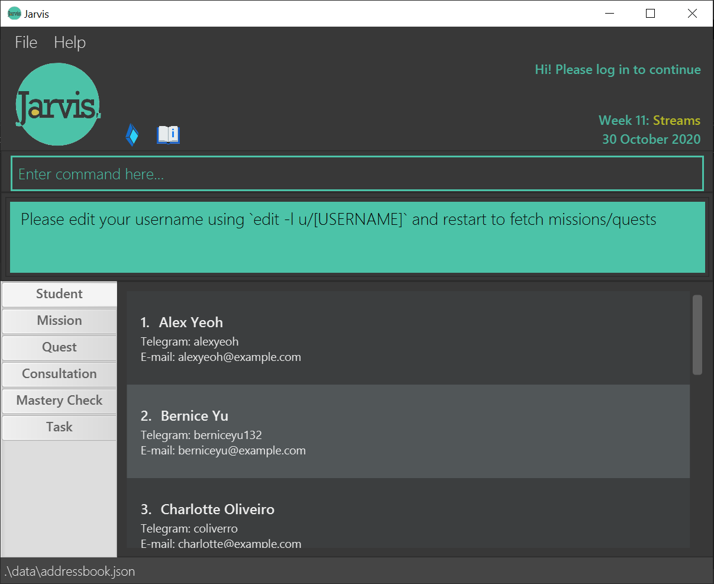

1. Upon start up, you will be prompted to log in to unlock Jarvis's
 full set of features.
 Please refer to the logging in segment below to complete your log in.

1. Type the command in the command box and press Enter to execute it. e.g. typing help and pressing Enter will open the help window.
   Some example commands you can try:
   * `view -s:  Lists all students. `
   * `view -s John Doe: Lists information about a student named John Doe.`
   * `add -t DESCRIPTION : Adds a todo task with specified description.`
   * `edit -t TASK_ID : Marks the task referenced by Task_ID as Done.`
   * `exit : Exits the app.`

1. Refer to the Features below for details of each command.

--------------------------------------------------------------------------------------------------------------------
## Navigating Jarvis

Jarvis has a Graphical User Interface centered around a command input box on the top, surrounded by a light green
line. The green box below the command input box is the user feedback box. Jarvis provides feedback to the user through
this box.

The core features are based on Students, Consultations, Missions, Quests and Tasks.
Each core feature has a tab for the organisation of its information.

To navigate the features, there are 2 methods which could be used individually, or mixed. We have designed
this flexibility with you, the user in mind.
 1. Only inputting commands into the box annotated "Enter command here..".
 1. Clicking on the tabs.

--------------------------------------------------------------------------------------------------------------------
## Logging in

The following is the prompt upon first log in, you are prompted to key in your Sourceacademy username and password:

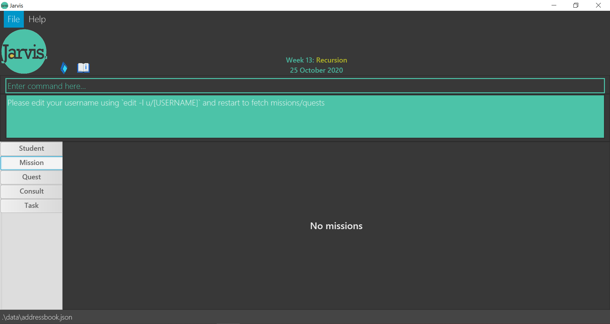

To log in, simply edit your log in details with the following command:
 **Format: `edit -l u/LUMINUS_USERNAME p/LUMINUS_PASSWORD`**
 Examples:
* `edit -l u/nusstu\e1234567 p/testpassword`

An example of the command being inputted:

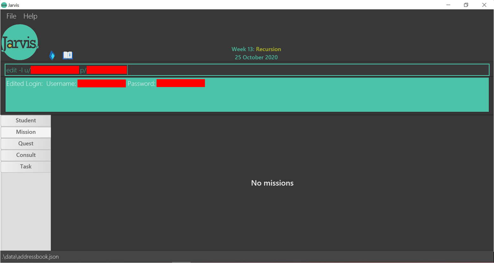

Within the green rectangle box, Jarvis will notify you if the log in was successful. Upon success, all information from
 sourceacademy will be visible
 to you.

--------------------------------------------------------------------------------------------------------------------

## Features
**UI Layout** (Everyone)
 
   * The user interface is split into clearly marked tabs: `Students`, `Missions`, `Quests`, `Consultations`, `Tasks`.
 
   * Clicking on each tab will give you the information you require for that field.

**Notes about the command format:**  (Wiline)
   * Words in UPPER_CASE are the parameters to be supplied by you.
     e.g. in `add -t DESCRIPTION`, `DESCRIPTION` is a parameter which can be used as `add -t Mark Missions`.

   * Items in square brackets are optional.
     e.g `view -c [NAME]`, name is an optional parameter. It can be used as `view -c` or as `view -c [John]`.

   * Items with …​ after them can be used multiple times including zero times.
     e.g. `[t/TAG]…​` can be used as ` ` (i.e. 0 times), `t/friend`, `t/friend t/family` etc.

   * Parameters can be in any order.
     e.g. if the command specifies `n/NAME p/PHONE_NUMBER`, `p/PHONE_NUMBER n/NAME` is also acceptable.

   * Commands with arrows indicate a multi-step process.
     e.g. `delete -c → 1` means that you should enter `delete -c` first and then `1` after the prompt
   has been processed.

**Notes about Jarvis' relationship with Sourceacademy:** (Peirong)  
* Students’ names that are under the Avenger will be fetched automatically from sourceacademy.nus.edu.sg upon startup.
* Luminus username and passwords will be stored in plaintext.

### 1. Viewing help : `help` (Zhen Teng)

Shows a message explaining how to access the help page.
 **Format: `help`**

### 2. Adding Information: `add`

#### 2-1. Adding Todos: `add -t` (Jun Jie)
Adds your personal `Todo` with a `description`.

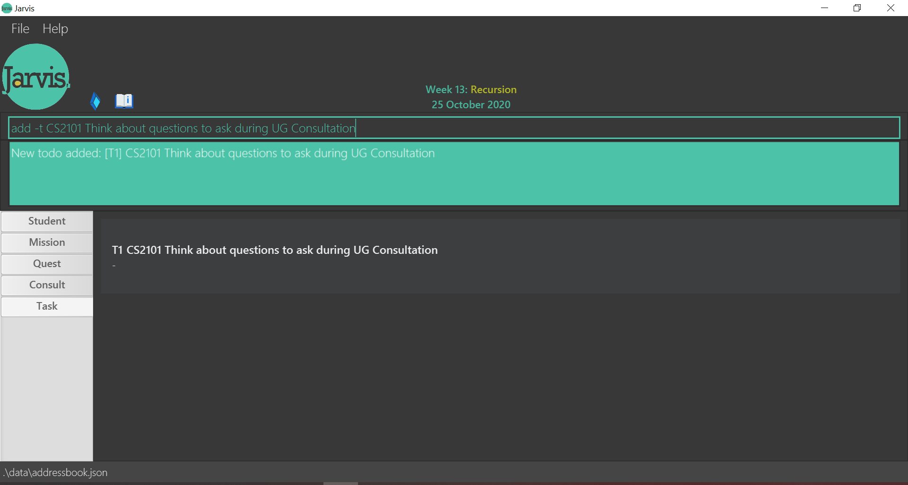

 **Format: `add -t DESCRIPTION`**
 Examples:
* `add -t Clear the bin`
* `add -t Return calculator to Mary`

#### 2-2. Adding Events: `add -e` (Jun Jie)
Adds your personal `Event` with a `description`, to attend at a specific `date` and `time`.

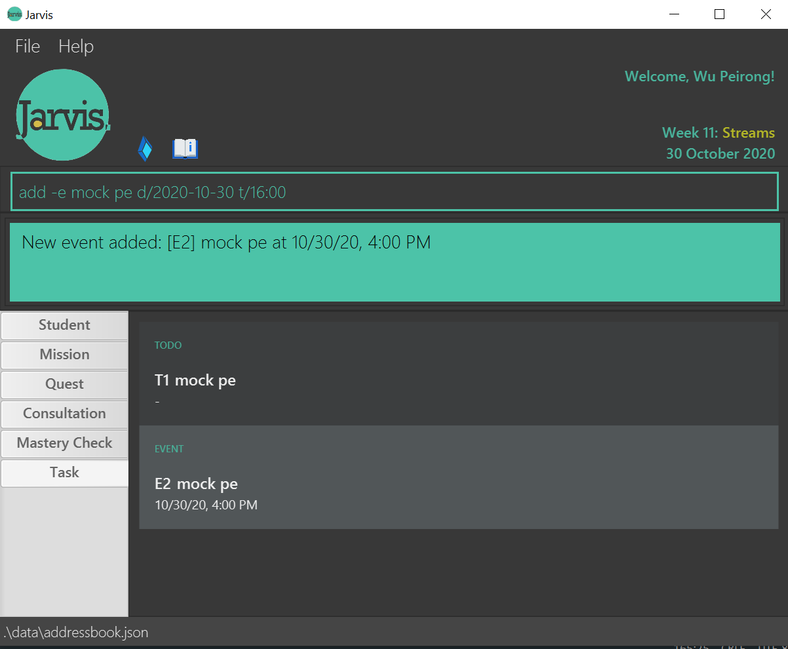

 **Format: `add -e DESCRIPTION d/YYYY-MM-DD t/HH:MM`**
 Examples:
* `add -e John’s birthday party d/2020-09-21 t/20:00`
* `add -e CS2103T team meeting d/2020-09-27 t/10:30`

An `Event` requires extra `date` and `time` specifications in order to create.

#### 2-3. Adding Deadlines: `add -d` (Jun Jie)
Adds your personal `Deadline` with a `description`, to complete by a specific `date` and `time`.

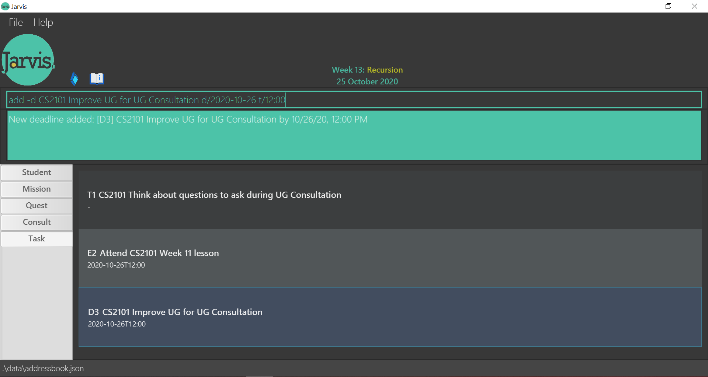

 **Format: `add -d DESCRIPTION d/YYYY-MM-DD t/HH:MM`**
 Examples:
* `add -d CS2103T Week 5 ip tasks d/2020-09-08 t/23:59`
* `add -d Research project report d/2020-10-05 t/10:30`

Similar to `Event`, a `Deadline` requires extra `date` and `time` specifications in order to create.

#### 2-4. Adding Consultations: `add -c` (Eryn)
Adds a `Consultation` session with a `Student` at a specific `date` and `time`.
 **Format: `add -c NAME d/YYYY-MM-DD t/HH:MM`**
 Examples:
* `add -c John Doe d/2020-09-20 t/13:30`
* `add -c Mary Jane d/2021-01-02 t/09:15`

#### 2-5. Adding Mastery Checks: `add -mc` (Eryn)
Adds a `Mastery Check` session with a `Student` at a specific `date` and `time`.
 **Format: `add -mc NAME d/YYYY-MM-DD t/HH:MM`**
 Examples:
* `add -mc John Doe d/2020-09-20 t/13:30`
* `add -mc Mary Jane d/2021-01-02 t/09:15`

### 3. Editing Information: `edit`

#### 3-1. Editing Login Information: `edit -l` (Peirong)
Similar to the format for editing students above, you can use tags to specify the field to be edited.
 **Format: `edit -l u/LUMINUS_USERNAME p/LUMINUS_PASSWORD`
 Examples:
* `edit -l u/nusstu\e1234567 p/testpassword`
* `edit -l p/testpassword`

#### 3-2. Editing Student Information: `edit -s` (Peirong)
`INDEX` refers to the number beside the student in the student list tab.
Include tags followed by the updated information such as `t/maryjane132` or `e/e1234222@u.nus.edu` to edit the
information which corresponds to that tag.
 **Format: `edit -s INDEX t/TELEGRAM_ID e/EMAIL s/PARTICIPATION_SCORE`**
 Examples:
* `edit -s 1 t/johndoe132 e/e1234567@u.nus.edu`
* `edit -s 2 t/maryjane132 s/3`

### 4. Deleting Information: `delete`

#### 4-1. Deleting Tasks: `delete -t` (Jun Jie)
Deletes a task based on the `TASK_ID` you specify.

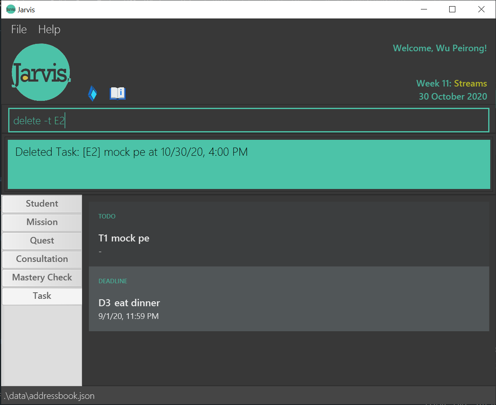

 **Format:`delete -t TASK_ID`**
 Examples:
* `delete -t T3`
* `delete -t D2`

#### 4-2 Deleting Consultations: `delete -c` (Eryn)
Shows a list of `Consultations` with `id numbers` so that you can specify which session you want to delete.
If a `Student name` is entered after the command, it shows only the sessions with the specific student.
 **Format: `delete -c [NAME]`**
 Examples:
* `delete -c
   → 3`
* `delete -c John Doe
   → 2`

#### 4-3. Deleting Mastery Checks: `delete -mc` (Eryn)
Similar to the above process of deleting consultations, deleting `Mastery Checks` first
shows a list of `Mastery Checks` with `id numbers` so that you can specify which session you want to delete.
If a `Student name` is entered after the command, it shows only the sessions with the specific student.
 **Format: `delete -mc [NAME]`**
 Examples:
* `delete -mc → 3`
* `delete -mc John Doe
   → 2`
   
### 5. Viewing Information: `view`

#### 5-1 Viewing a list of all students: `view -s` (Zhen Teng)
Shows a list of all students under the tutor in JARVIS.
Please take note of the command inputted into the command box to understand how the respective commands are inputted.

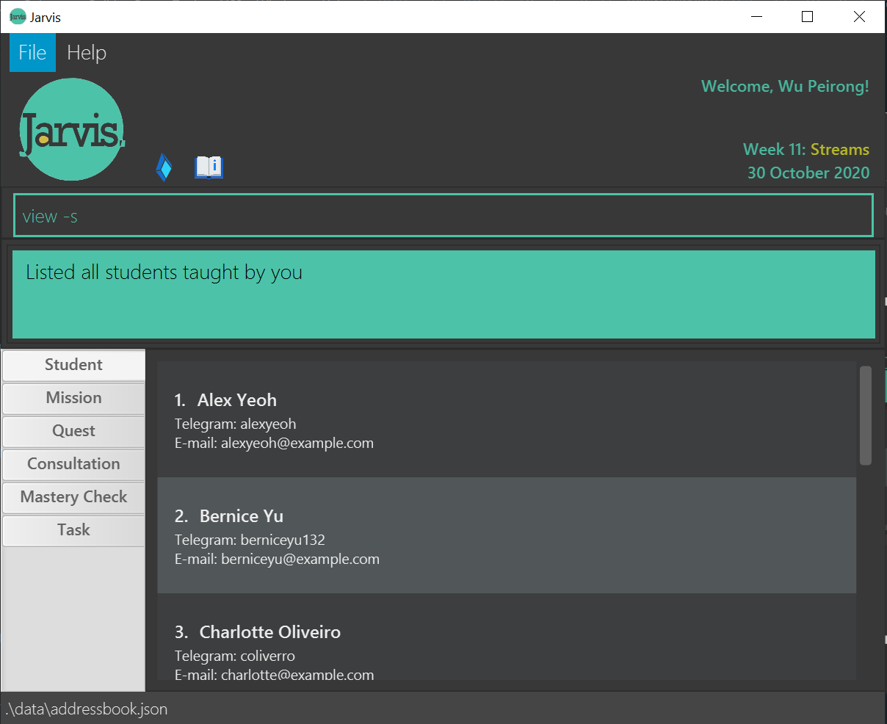

If a student name is entered after the command, Jarvis shows one specific student only.

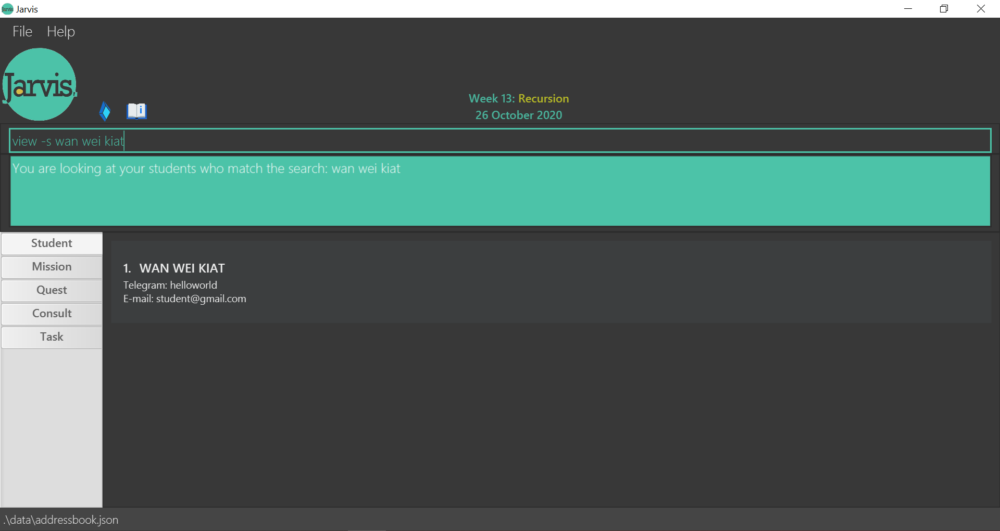

 **Format: `view -s [NAME]`**

#### 5-2. Viewing all consultation sessions: `view -c` (Eryn)
Shows all `confirmed consultation` sessions, both past and upcoming. If you enter a `Student name` after the command, it will show `all consultation` sessions confirmed with the specific student.
 **Format: `view -c [NAME]`**
 Examples:
* `view -c`
* `view -c John Doe`

#### 5-3. Viewing past consultation sessions: `view -cp` (Peirong)
Shows all `past consultation` sessions. If you enter a `Student name` after the command, it will show `past consultation` sessions with the specific student.
 **Format: `view -cp [NAME]`**
 Examples:
* `view -cp`
* `view -cp John Doe`

#### 5-4. Viewing upcoming consultation sessions: `view -cu` (Peirong)
Shows all `upcoming consultation` sessions. If you enter a `Student name` after the command, it will show `upcoming consultation` sessions with the specific student.
 **Format: `view -cu [NAME]`**
 Examples:
* `view -cu`
* `view -cu John Doe`

#### 5-5. Viewing all Mastery Check sessions: `view -mc` (Eryn)
Shows all `confirmed MC` sessions, both past and upcoming.
 **Format: `view -mc`**
 Examples:
* `view -mc`

#### 5-6. Viewing past Mastery Check sessions: `view -mcp` (Eryn)
Shows all `past MC` sessions.
 **Format: `view -mcp`**
 Examples:
* `view -mcp`

#### 5-7. Viewing upcoming Mastery Check sessions: `view -mcu` (Eryn)
Shows all `upcoming MC` sessions.
 **Format: `view -mcu`**
 Examples:
* `view -mcu`

#### 5-8. Viewing deadline for missions: `view -m` (Wiline)
Shows the deadline for the current mission(s).
 **Format: `view -m`**

You may also click on the `Mission` tab to do so.

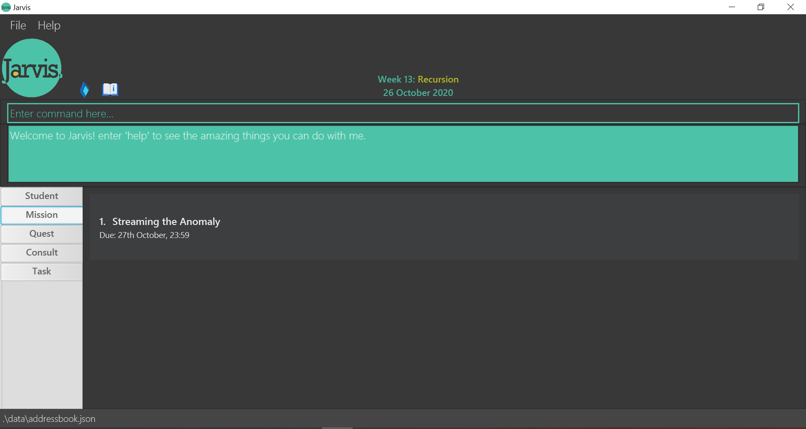

#### 5-9. Viewing deadline for quests: `view -q` (Wiline)
Shows the deadline for the current quest(s).
 **Format: `view -q`**

You may also click on the `Quest` tab to do so.

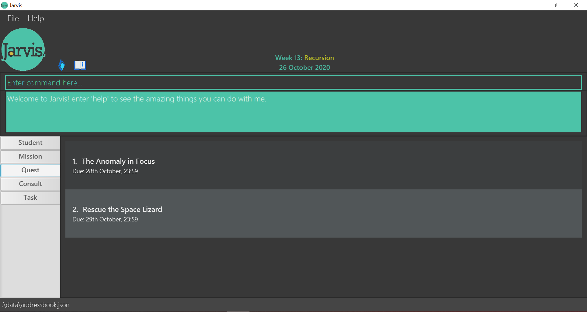

#### 5-10. Viewing ungraded missions: `view -um` (Wiline)
Shows the missions that you have not yet graded.

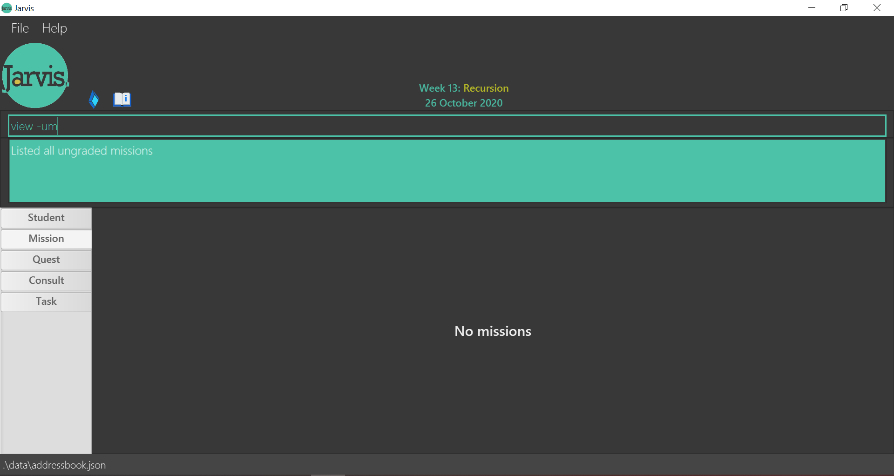

 **Format: `view -um`**

#### 5-11. Viewing ungraded quests: `view -uq` (Wiline)
Shows the quests that you have not yet graded.

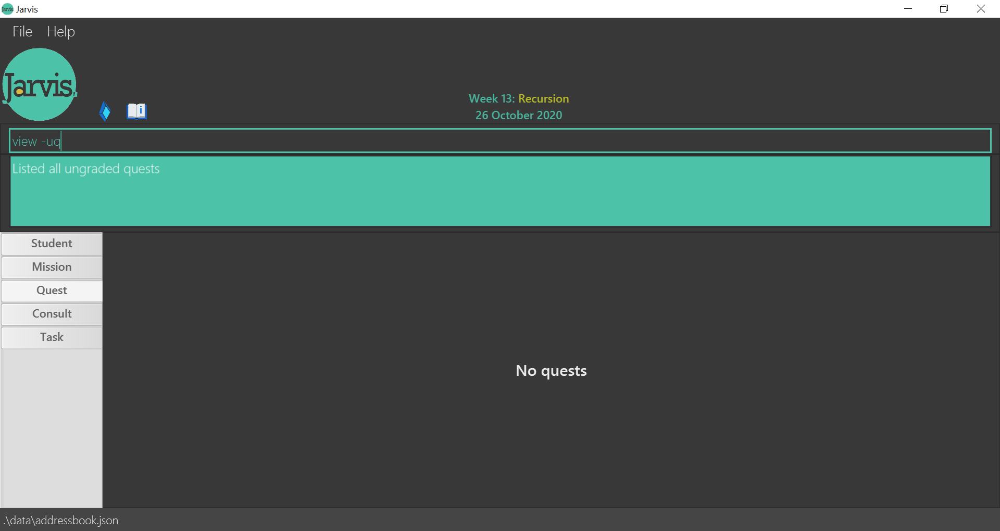

 **Format: `view -uq`**

#### 5-12. Viewing studio participation marks of a specific student: `view -p` (Zhen Teng)
Shows the studio participation marks of a student.
 **Format: `view -p [Name]`**
 Examples:
* `view -p John Doe`

#### 5-13. Viewing all Tasks: `view -t` (Jun Jie)
Shows the list of all your current tasks.
 **Format: `view -t`**

#### 5-14. Viewing all Todos: `view -tt` (Jun Jie)
Shows the list of all your current todos.
 **Format: `view -tt`**

#### 5-15. Viewing all Events: `view -te` (Jun Jie)
Shows the list of all your current events.
 **Format: `view -te`**

#### 5-16. Viewing all Deadlines: `view -td` (Jun Jie)
Shows the list of all your current deadlines.
 **Format: `view -td`**

### 6. Exiting the program : `exit` (Zhen Teng)
Exits the program.
 **Format: `exit`**

### 7. Saving the data (Peirong)
JARVIS data are saved in the hard disk automatically after any command that changes the data. There is no need to save manually.

### FAQ (Peirong)
`Q: How do I transfer my data to another Computer?`
 `A: Install the app in the other computer and overwrite the empty data file(.txt file) it creates with the file(.txt file) that contains the data of your previous JARVIS home folder.`

## Command summary

#### Add (Jun Jie)
<!--- Not sure why the format is not working on github page :(
      Replaced with a table image for now
| Function | Tag | Format, Examples |
| -------- | --- | ---------------- |
| Add Todo | -t | add -t DESCRIPTION |
| Add Event | -e | add -e DESCRIPTION d/YYYY-MM-DD t/HH:MM |
| Add Deadline | -d | add -d DESCRIPTION d/YYYY-MM-DD t/HH:MM |
| Add Consultation | -c | add -c NAME d/YYYY-MM-DD t/HH:MM |
| Add Mastery Check | -mc | add -c NAME d/YYYY-MM-DD t/HH:MM |
-->

#### Edit (Wiline)
<!---
| Function | Tag | Format, Examples |
| -------- | --- | ---------------- |
| Edit Student details | -s | edit -s NAME t/TELEGRAM_ID e/EMAIL s/PARTICIPATION_SCORE |
| Edit Login details | -l | edit -l u/LUMINUS_USERNAME p/LUMINUS_PASSWORD |
-->

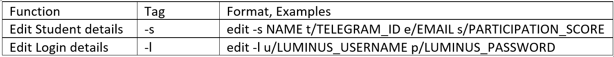

### Delete (Zhen Teng)
<!---
| Function | Tag | Format, Examples |
| -------- | --- | ---------------- |
| Delete Task | -t | delete -t TASK_ID |
| Delete Consultation | -c | delete -c NAME  E.g. delete -c → 3 / delete -c John Doe → 2 |
| Delete Mastery Check | -mc | delete -mc NAME  E.g. delete -mc → 3 / delete -mc John Doe → 2 |
-->

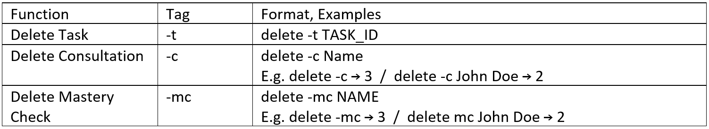

#### View (Zhen Teng)
<!---
| Function | Tag | Format, Examples |
| -------- | --- | ---------------- |
| View one Student | -s | view -s NAME |
| View all Consultations | -c | view -c NAME  E.g. view -c / view -c John Doe |
| View all Past Consultations | -cp | view -cp NAME  E.g. view -cp, view -cp John Doe |
| View all Upcoming Consultations | -cu | view -cu NAME  E.g. view -cu / view -cu John Doe |
| View all Mastery Checks | -mc | view -mc |
| View all Past Mastery Checks | -mcp | view -mcp |
| View all Upcoming Mastery Checks | -mcu | view -mcu  |
| View Deadlines for Missions | -m | view -m |
| View Deadlines for Quests | -q | view -q |
| View Ungraded Missions | -um | view -um |
| View Ungraded Quests | -uq | view -uq |
| View all Tasks | -t | view -t |
| View all Todos | -tt | view -tt |
| View all Events | -te | view -te |
| View all Deadlines | -td | view -td |
-->

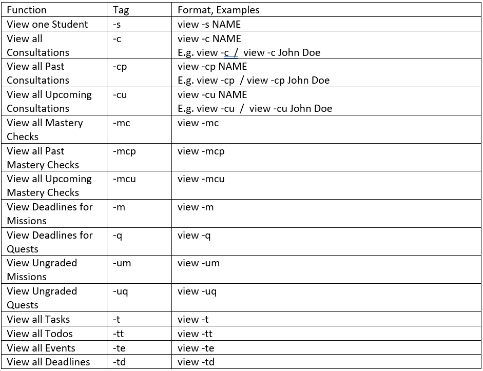

#### Exit (Peirong)
<!---
| Function | Format, Examples |
| -------- | ---------------- |
| Exits program | `exit` |
-->

#### Help (Peirong)
<!---
| Function | Format, Examples |
| -------- | ---------------- |
| Provide help with
program commands | `help` |
-->

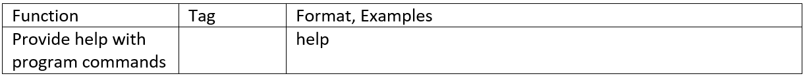
